# PM Work Intelligence — System Architecture

- **Status:** Implementation-ready
- **Applies to:** MVP scope
- **Reference docs:** `00_PRODUCT_VISION.md`, `01_PRD.md`

---

## 1. High-Level Architecture

PM Work Intelligence follows a **modular, service-oriented monolith** architecture for the MVP, with clearly separated logical layers so it can be split into independent services in later horizons without a rewrite.

The system is composed of six logical layers:

| Layer | Technology | Responsibility |
|-------|-----------|----------------|
| **Client** | Next.js 15 (React, TypeScript, Tailwind) | UI, client-side state, API consumption, conversational capture surface |
| **API Gateway / BFF** | Next.js App Router (Server Components + Route Handlers) | Auth, server-side rendering, API proxying to the Python backend, session management |
| **Application Services** | FastAPI (Python) | Domain logic: configuration, capture, work-log management, reporting, analytics, notifications |
| **AI Services** | FastAPI internal modules + LLM provider SDK | Conversational structuring, entity extraction, report/insight generation, clarification |
| **Data Layer** | PostgreSQL (primary), Redis (cache/queue), S3-compatible object storage (artifacts) | Durable storage of records, configurations, analysis results, and exported artifacts |
| **Infrastructure** | Docker, AWS (ECS/Fargate or EKS), RDS, CloudFront, S3 | Deployment, scaling, monitoring, secrets, CI/CD |

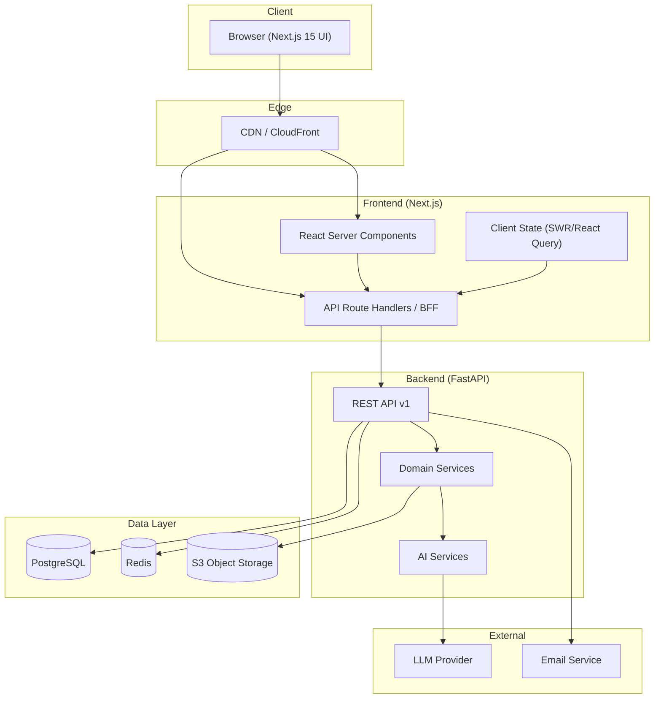

### 1.1 Architecture Decisions

| Decision | Choice | Rationale |
|----------|--------|-----------|
| Monolith-first | Service-oriented monolith | MVP team velocity; avoids distributed-systems overhead; clear module boundaries allow later extraction |
| BFF pattern | Next.js Route Handlers proxy to FastAPI | Single frontend origin, simplified CORS/auth, server-side session handling |
| Config-driven AI | No hardcoded entity lists | Configuration is injected into prompts and extraction schemas |
| Async AI processing | Background workers + Redis | Keeps conversational capture responsive; long-running structuring/report jobs decoupled |
| Idempotent providers | LLM provider abstraction | Multi-provider resilience, graceful degradation, cost control |

---

## 2. Frontend Architecture

The frontend is a **Next.js 15 App Router** application with TypeScript and Tailwind CSS, using the `src/` directory convention.

### 2.1 Layers

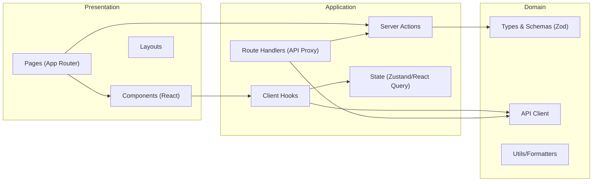

### 2.2 Routing Structure (App Router)

| Route | Purpose |
|-------|---------|
| `/` | Landing / redirect to dashboard |
| `/login`, `/register` | Authentication |
| `/onboarding` | Guided configuration of first KRA/project/stakeholder |
| `/dashboard` | Analytics dashboard and insights |
| `/capture` | Conversational work capture (chat interface) |
| `/log` | Work-log review, filtering, confirmation, manual entry |
| `/reports` | Report generation, editing, export |
| `/settings/*` | Configuration of KRAs, projects, stakeholders, categories, AI preferences |

### 2.3 Rendering Strategy

| Concern | Approach |
|---------|----------|
| Dashboard & log views | **Server Components** with server-side data fetch; streaming with Suspense |
| Capture chat | **Client Component** (interactive, streaming response) |
| Forms & settings | **Client Components** with optimistic updates via React Query/SWR |
| Auth state | Middleware + server-side session cookies; client guards for capture page |
| Real-time feel | SSE (Server-Sent Events) streamed from Route Handler to the capture UI |

### 2.4 Client State

- **Server cache:** SWR or React Query for API data (work logs, configs, dashboards) with stale-while-revalidate.
- **Client state:** Zustand for ephemeral UI state (chat session messages, filters).
- **Server state:** Session cookie (HttpOnly) validated by the BFF on every route handler call.

### 2.5 Styling & Design System

- Tailwind CSS utility-first styling.
- Shared design tokens (colors, spacing, typography) in Tailwind theme config.
- Component library built on Headless UI / Radix primitives (accessible), composed into feature components.

---

## 3. Backend Architecture

The backend is a **FastAPI (Python)** application exposing a versioned REST API (`/api/v1`). It is organized as a modular monolith with clear domain boundaries that map 1:1 to future microservices.

### 3.1 Module Layout

| Module | Responsibility |
|--------|----------------|
| `auth` | Login, signup, password recovery, session tokens |
| `config` | CRUD for KRAs, projects, stakeholders, categories |
| `capture` | Conversation sessions, message handling, provenance |
| `structuring` | AI extraction orchestration, confidence, clarification |
| `worklog` | Work entries, status lifecycle, manual entry |
| `reporting` | Report generation templates, narrative, export |
| `analytics` | Aggregations, effort distribution, insights engine |
| `notifications` | In-app and email notifications |
| `integrations` | (Stub for MVP) external tool adapters |
| `export` | Full data export (JSON/CSV/Markdown) and deletion |

### 3.2 Layering within each module

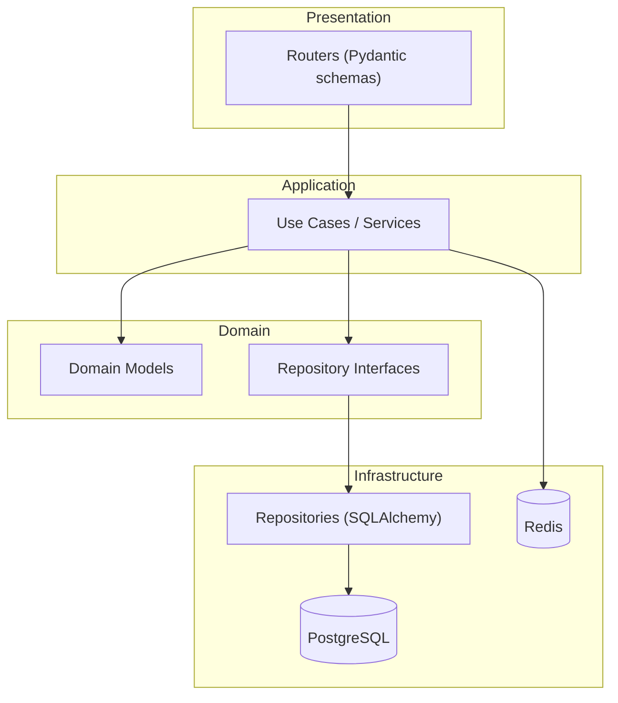

### 3.3 Key Backend Decisions

| Decision | Choice | Rationale |
|----------|--------|-----------|
| Sync API + async workers | FastAPI async endpoints for I/O; background workers (RQ/Celery-style) for AI jobs | Fast conversational responses; AI work isolated |
| ORM | SQLAlchemy 2.x (async) with Alembic migrations | Type-safe, production-proven, migration-friendly |
| Validation | Pydantic v2 schemas at API boundary + domain models | Input/output contracts; OpenAPI docs auto-generated |
| Auth | JWT access tokens + refresh tokens (HttpOnly cookies) | Stateless API auth, revocable sessions |
| Config snapshotting | Config versions captured at AI-call time | Reports/analysis remain valid if config changes later |

### 3.4 API Surface (v1)

| Method | Endpoint | Purpose |
|--------|----------|---------|
| POST | `/auth/register` | Create account |
| POST | `/auth/login` | Authenticate, set session |
| POST | `/auth/logout` | Revoke session |
| GET | `/config/kras` · `/config/projects` · `/config/stakeholders` · `/config/categories` | Read configuration |
| POST/PATCH/DELETE | `/config/*` | Create/update/archive configuration entities |
| POST | `/capture/sessions` | Start a capture session |
| POST | `/capture/sessions/{id}/messages` | Submit natural-language message |
| GET | `/capture/sessions/{id}` | Retrieve conversation history |
| GET | `/worklog/entries` | Query work entries (filters, date range) |
| PATCH | `/worklog/entries/{id}` | Confirm/edit/reject entries |
| POST | `/worklog/entries/manual` | Manual entry fallback |
| POST | `/reports` | Generate a report (daily/weekly/custom) |
| GET | `/reports/{id}` · GET `/reports/{id}/export` | Read/export report |
| GET | `/analytics/dashboard` | Dashboard aggregates and insights |
| POST | `/export` | Full data export job |
| DELETE | `/user` | Account deletion |

---

## 4. AI Architecture

The AI layer is the differentiator: it turns natural conversation into structured, configuration-aware work intelligence while honoring the core principles of provenance, confidence, and no fabrication.

### 4.1 Components

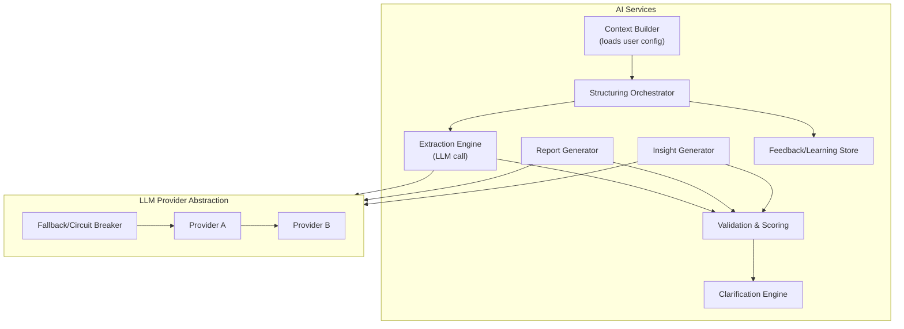

### 4.2 Structuring Pipeline

```mermaid
sequenceDiagram
    participant U as User
    participant CAP as Capture Module
    participant ORCH as Orchestrator
    participant CB as Context Builder
    participant LLM as LLM Provider
    participant VAL as Validator
    participant WL as Work Log

    U->>CAP: natural language message
    CAP->>ORCH: raw text + session id
    ORCH->>CB: load KRAs/projects/stakeholders/categories
    CB-->>ORCH: configured vocabulary (versioned)
    ORCH->>LLM: extraction prompt + config context + text
    LLM-->>ORCH: candidate structured entries (JSON schema)
    ORCH->>VAL: validate entities against config; score confidence
    VAL-->>ORCH: validated entries + confidence + ambiguity flags
    alt ambiguous or low confidence
        ORCH-->>CAP: clarifying questions
        CAP-->>U: ask user
        U-->>CAP: clarification answers
        CAP-->>ORCH: re-run extraction
    end
    ORCH->>WL: draft entries with provenance + config version
    WL-->>CAP: drafts ready for review
    CAP-->>U: structured drafts + confidence indicators
```

### 4.3 Design Guarantees

| Guarantee | Implementation |
|-----------|----------------|
| **Configuration-driven** | All allowed entity values injected from DB; never hardcoded in prompts |
| **Provenance** | Every field carries a reference to source text segments (`source_ref`) |
| **Confidence** | Per-field confidence (`0–1`) computed by validator; thresholds surfaced in UI |
| **No fabrication** | Strict "closed-set" entity matching; unknowns become free text or clarification prompts; inferences explicitly labeled |
| **Ambiguity handling** | Clarification-first: never guess on multi-match or low-signal inputs |
| **Learning loop** | User edits/rejections stored as feedback; aggregated into per-user refinement hints and prompt tuning datasets |
| **Graceful degradation** | If LLM unavailable, capture endpoint returns 503 with guidance; manual entry remains fully functional |
| **Cost control** | Token budgets per call, context truncation, prompt caching, model tiering (fast model for extraction, strong model for reports) |

### 4.4 Prompt Engineering Approach

- **System prompt** built from: user role, configured vocabulary snapshot, extraction schema, provenance rules, and explicit no-fabrication instructions.
- **Structured output** enforced via JSON-schema-constrained output (tool/function calling where available).
- **Retry policy** with temperature 0 for extraction; temperature 0.4–0.7 for narrative report/insight generation.
- **Eval harness** with golden datasets for fabrication, accuracy, and ambiguity metrics (NFR-5 targets).

---

## 5. Database Architecture

See `03_DATABASE.md` for the full PostgreSQL schema design.

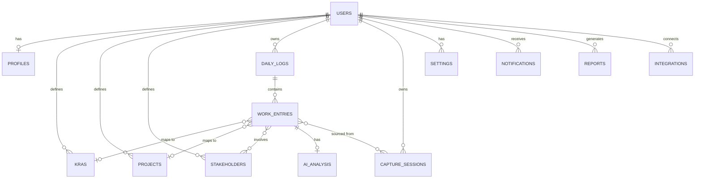

### Data Layer Components

| Component | Use |
|-----------|-----|
| **PostgreSQL** | Primary system of record: users, configs, work logs, analysis, reports, notifications, settings |
| **Redis** | Session cache, AI-job queue, rate limiting, idempotency keys, ephemeral dashboard aggregation cache |
| **S3-compatible storage** | Exported report artifacts (PDF/Markdown), export archives, imported source files |
| **Alembic** | Versioned schema migrations |

---

## 6. Authentication Flow

Auth uses **JWT access + refresh tokens** stored in **HttpOnly, Secure, SameSite cookies**, with Next.js middleware guarding protected routes and the BFF forwarding the session to FastAPI.

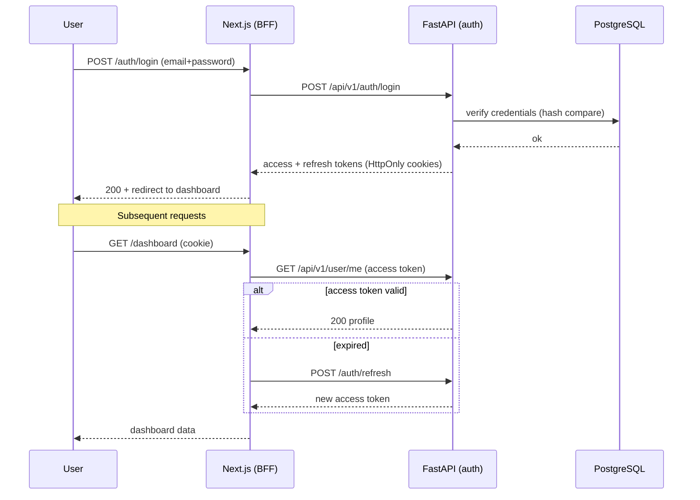

Security measures: bcrypt/argon2 password hashing, token rotation, refresh-token revocation, rate limiting on login, and CSRF protection for cookie-based auth.

---

## 7. Recording Flow

The recording flow is the core loop: **converse → structure → validate → report**.

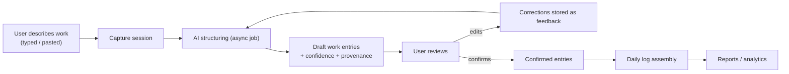

| Step | Detail |
|------|--------|
| **Capture** | User sends message(s); session persists; multi-part descriptions supported |
| **Structure** | Background worker runs the structuring pipeline; user sees progress via SSE |
| **Validate** | Draft entries appear in the review UI with confidence badges; low-confidence fields highlighted |
| **Confirm** | User confirms/edits/splits/merges/rejects; edits feed the learning loop |
| **Log** | Confirmed entries assemble into the daily log; daily log status tracked (`draft`/`confirmed`) |

---

## 8. AI Processing Flow

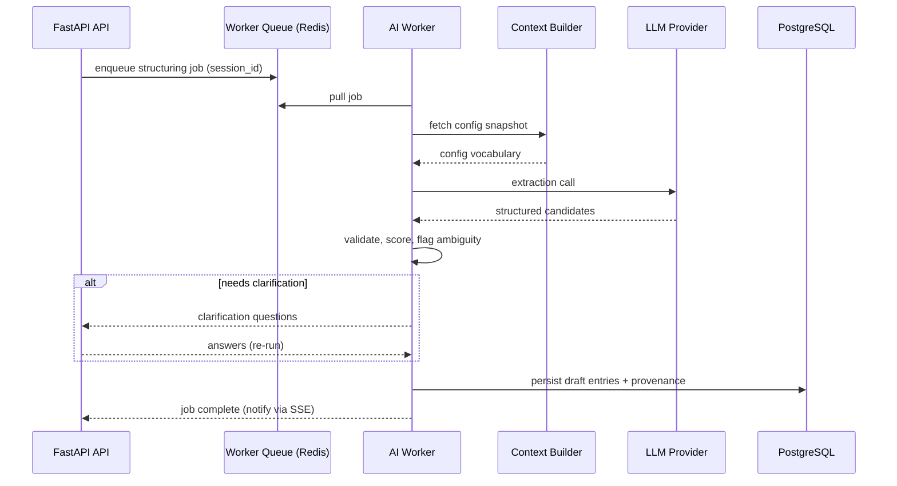

---

## 9. Dashboard Flow

The dashboard renders analytics from **confirmed** work entries only.

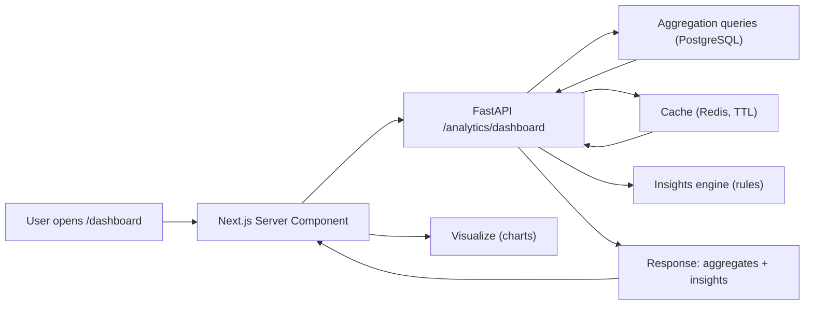

| Feed | Query source | Notes |
|------|--------------|-------|
| Effort by KRA / project / category | SQL GROUP BY on confirmed entries | Time range selectable; percentages sum to 100% |
| Time allocation actual vs. target | Join against category targets in settings | Target from config |
| Insights | Rules engine over aggregates | e.g., no confirmed entries this week, over-allocation, missing attribution |
| Insights state | `acknowledged`/`dismissed` persisted | Per user |

Aggregations for common ranges are cached in Redis (TTL ~60s); historical queries hit PostgreSQL directly.

---

## 10. Reporting Flow

Reports are generated asynchronously and are editable before export.

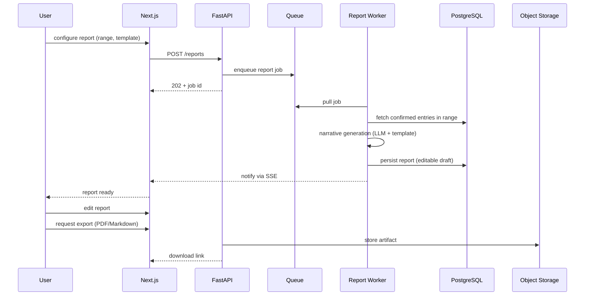

Report templates are configurable (sections, tone, verbosity) per PRD FR-6.6.

---

## 11. Deployment Architecture

The MVP deploys on **AWS** using containers orchestrated with ECS/Fargate (single-region to start), with a path to EKS/Kubernetes for later horizons.

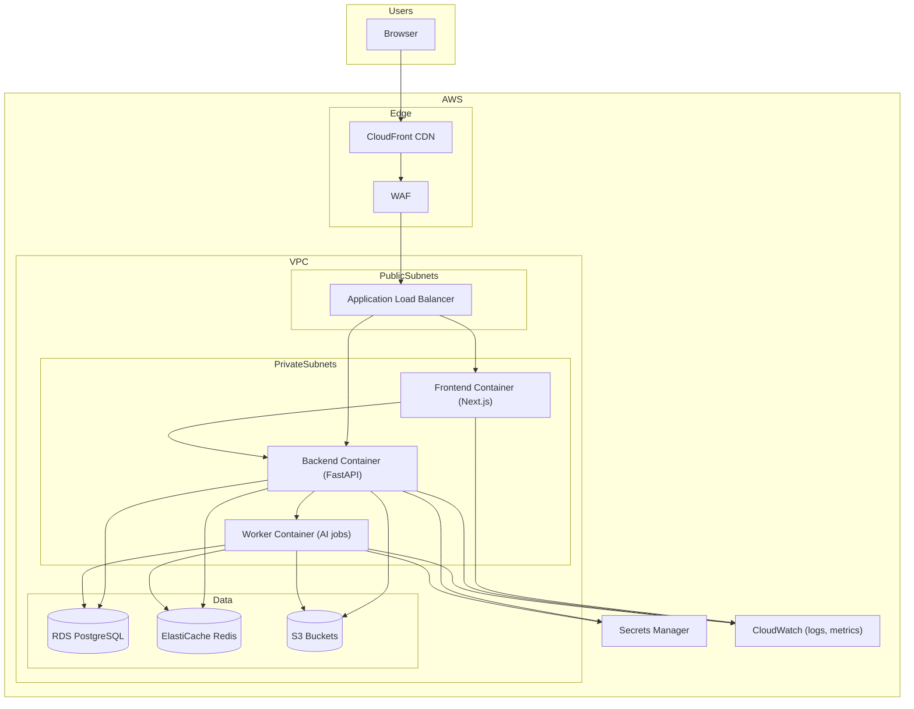

### 11.1 Infrastructure Components

| Component | Configuration |
|-----------|---------------|
| **CDN** | CloudFront in front of Next.js; static assets cached; API excluded from cache |
| **Compute** | ECS Fargate: `frontend` (1+ tasks), `backend` (2+ tasks), `worker` (auto-scaled by queue depth) |
| **Database** | RDS PostgreSQL 16, Multi-AZ, automated backups (7-day), point-in-time recovery |
| **Cache/Queue** | ElastiCache Redis cluster for cache + job queue; SQS optional for higher durability |
| **Storage** | S3 buckets for exports/artifacts with lifecycle policies |
| **Secrets** | AWS Secrets Manager; env-injected into containers; never in source control |
| **Observability** | CloudWatch logs/metrics/alarms; structured logging; OpenTelemetry traces |
| **CI/CD** | GitHub Actions → build → push ECR → ECS deploy; Alembic migrations as a step |

### 11.2 Environments

- **local** — Docker Compose (frontend, backend, worker, PostgreSQL, Redis).
- **staging** — mirrors production, seeded eval data, used for release validation.
- **production** — user-facing, guarded deploys, feature flags.

### 11.3 Graceful Degradation

- If the **LLM provider** is unavailable: capture returns an actionable status; manual entry remains fully functional.
- If **Redis** is unavailable: cache/queue degrade; database remains the source of truth.
- If the **backend** is unavailable: Next.js serves static content and an error boundary; no data loss.

---

## 12. Folder Structure

### 12.1 Monorepo Layout

```
work-intelligence-app/
├── frontend/                  # Next.js 15 application
│   ├── src/
│   │   ├── app/               # App Router pages
│   │   │   ├── (auth)/        # login, register
│   │   │   ├── (dashboard)/   # dashboard, capture, log, reports
│   │   │   └── settings/      # config management
│   │   ├── components/        # UI and feature components
│   │   ├── lib/               # API client, auth, utils
│   │   ├── types/             # shared TypeScript types
│   │   └── hooks/             # client-side data hooks
│   ├── public/
│   ├── tests/
│   ├── tailwind.config.ts
│   └── package.json
│
├── backend/                   # FastAPI application
│   ├── app/
│   │   ├── main.py            # FastAPI app, CORS, routers
│   │   ├── core/              # config, security, deps
│   │   ├── api/v1/            # routers + schemas
│   │   ├── modules/           # auth, config, capture, structuring,
│   │   │                      # worklog, reporting, analytics,
│   │   │                      # notifications, integrations, export
│   │   ├── models/            # SQLAlchemy models
│   │   ├── repositories/      # data access
│   │   ├── services/          # use cases / domain logic
│   │   ├── ai/                # orchestrator, context builder,
│   │   │                      # extractors, validators, providers
│   │   └── workers/           # background job handlers
│   ├── alembic/               # migrations
│   ├── tests/
│   ├── requirements.txt
│   └── README.md
│
├── docs/                      # Product & technical documentation
├── infra/                     # Terraform / docker-compose / CI
└── package.json (root)        # optional workspace orchestration
```

### 12.2 Module Boundary Rules

- **Frontend → Backend:** via versioned REST API only (no direct DB access).
- **Backend modules:** communicate through service interfaces; modules never import each other's repositories directly.
- **AI services:** consumed exclusively through the structuring/reporting services; isolated behind a provider abstraction.
- **Config versioning:** any module reading configured vocabulary must snapshot the version used.

---

## 13. Future Scalability

### 13.1 Near-Term Scaling (Team Horizon)

- **Multi-tenancy:** add `organization_id` / workspace scoping to entities; introduce org-level configs and shared resources.
- **Service extraction:** extract `AI Structuring Service` and `Reporting Service` into standalone deployments behind an internal gateway.
- **Read replicas:** offload analytics/aggregation reads to RDS read replicas.
- **Materialized views:** pre-aggregate daily/weekly rollups for dashboard performance.
- **Queue durability:** migrate from Redis to SQS for guaranteed delivery of AI jobs.

### 13.2 Mid-Term Scaling (Organization Horizon)

- **Event-driven architecture:** introduce a domain event bus (Kafka or SNS/SQS) for config changes, work-log confirmation, and report completion.
- **Data warehouse:** stream work-log aggregates into a warehouse (Redshift/BigQuery) for org-wide analytics and benchmarking.
- **CQRS:** separate write model (PostgreSQL) from read/analytics model (warehouse + OLAP cache).
- **Multi-region:** regional deployments with cross-region replication of metadata; user data residency controls.

### 13.3 Long-Term Scaling (Orchestration Horizon)

- **Model/agent mesh:** multiple specialized agents (capture, summarization, insight, forecasting) coordinated by an orchestrator; model-routing by cost/latency/quality.
- **Vector storage:** semantic retrieval over historical work records for query-answering and proactive suggestions.
- **Horizontal worker autoscaling:** predictive autoscaling of AI workers based on queue depth and historical demand.
- **Partitioning:** time-partitioned work-entry and analysis tables to bound hot-table growth.

### 13.4 Scalability Guardrails

- All new features must specify their **data-access pattern** (read/write ratio, hot query) before landing.
- Dashboard/reporting must never block write-path capture.
- Any entity eligible for "shared" status (projects, stakeholders) is designed for tenancy from day one.
- AI calls are always non-blocking to the capture UX and isolated to the worker tier.
