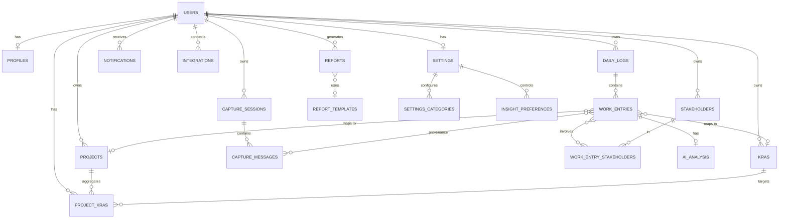

# PM Work Intelligence — Database Design

- **Status:** Implementation-ready
- **Database:** PostgreSQL 16+
- **Reference docs:** `01_PRD.md`, `02_ARCHITECTURE.md`

---

## 1. Overview

This document specifies the PostgreSQL schema for the PM Work Intelligence MVP. The design follows production-grade practices:

- **Single-tenant data isolation** via a `user_id` foreign key on every user-owned table (row-level ownership).
- **Soft deletion** (`deleted_at`) for user-facing entities so that history and provenance are never lost.
- **Config snapshotting** so that AI analysis and reports remain valid if configuration changes later.
- **Concurrency-safe** with optimistic locking (`version` / `updated_at`) where edits can race.
- **Enums represented as native PostgreSQL `ENUM` types** for constrained fields, with a documented migration path to reference tables when they become user-configurable.
- **Immutable audit columns** (`created_at`, `updated_at`, `deleted_at`) on every table.

### Naming & Conventions

- Tables: `snake_case`, plural nouns (`work_entries`).
- Primary keys: `id BIGSERIAL` (or `UUID` where noted).
- Foreign keys: `<table_singular>_id`.
- Timestamps: `TIMESTAMPTZ`, stored in UTC.
- Monetary/ratio values: `NUMERIC` to avoid float drift; durations in `NUMERIC` hours (up to 3 decimals).

---

## 2. ER Diagram

---

## 3. Relationships Summary

| Relationship | Cardinality | Description |
|--------------|-------------|-------------|
| Users → Profiles | 1:1 | Extended profile data |
| Users → KRAs | 1:N | Each KRA belongs to exactly one user |
| Users → Projects | 1:N | Each project belongs to exactly one user |
| Projects → KRAs | M:N | Via `project_kras` join table |
| Users → Stakeholders | 1:N | Each stakeholder belongs to exactly one user |
| Users → DailyLogs | 1:N | A daily log is owned by one user |
| DailyLogs → WorkEntries | 1:N | A log contains many work entries |
| WorkEntries → KRAs | N:1 | One KRA per entry (nullable) |
| WorkEntries → Projects | N:1 | One project per entry (nullable) |
| WorkEntries → Stakeholders | M:N | Via `work_entry_stakeholders` |
| WorkEntries → AIAnalysis | 1:1 | One analysis per entry (lazy-created) |
| WorkEntries → CaptureMessages | M:N | Via `work_entry_sources` (provenance) |
| CaptureSessions → CaptureMessages | 1:N | Messages belong to a session |
| Users → Reports | 1:N | Reports owned by one user |
| ReportTemplates → Reports | 1:N | Reports reference a template (nullable) |
| Users → Notifications | 1:N | Notifications targeted at one user |
| Users → Integrations | 1:N | Integration accounts per user |
| Users → Settings | 1:1 | Row of user preferences |
| Settings → SettingsCategories | 1:N | Time-allocation categories |
| Settings → InsightPreferences | 1:N | Insight rule toggles/thresholds |

---

## 4. Table Specifications

---

### 4.1 `users`

**Purpose:** Authentication and account-level identity. The root of all data ownership and access control.

**Columns**

| Column | Data Type | Nullable | Default | Description |
|--------|-----------|----------|---------|-------------|
| `id` | `BIGSERIAL` | No | auto | Primary key |
| `email` | `VARCHAR(320)` | No | — | Login identifier, normalized lowercase |
| `password_hash` | `VARCHAR(255)` | No | — | bcrypt/argon2 hash, never plaintext |
| `status` | `ENUM('active','suspended','deleted')` | No | `'active'` | Account lifecycle state |
| `email_verified_at` | `TIMESTAMPTZ` | Yes | `NULL` | Set on email verification |
| `created_at` | `TIMESTAMPTZ` | No | `now()` | Immutable creation time |
| `updated_at` | `TIMESTAMPTZ` | No | `now()` | Last update time |
| `deleted_at` | `TIMESTAMPTZ` | Yes | `NULL` | Soft-delete marker; `NULL` = active |

**Relationships**

- Has **1:1** → `profiles`
- Has **1:N** → `kras`, `projects`, `stakeholders`, `daily_logs`, `capture_sessions`, `reports`, `notifications`, `integrations`
- Has **1:1** → `settings`

**Indexes**

| Index | Columns | Type | Purpose |
|-------|---------|------|---------|
| `pk_users` | `id` | Primary | Row identity |
| `uq_users_email` | `email` | Unique | Enforce one account per email; fast login lookup |
| `idx_users_status` | `status` | B-tree | Filter active accounts |

**Constraints**

- `email` unique, NOT NULL, validated format at application layer.
- Partial unique index on `email` where `deleted_at IS NULL` recommended if email reuse across soft-deleted accounts is disallowed.

**Future Scalability**

- Add `organization_id` column + index for multi-tenant workspaces (Horizon 2). `status` transitions toward a larger lifecycle enum.
- Plan for **auth provider migration** by storing `auth_provider` and external subject ID columns.
- For very large user tables, partition by `created_at` month only if growth demands; B-tree on email suffices for MVP.

---

### 4.2 `profiles`

**Purpose:** Extended user information and display preferences, kept separate from auth-critical `users` data to minimize the attack surface and allow profile-schema evolution without touching auth.

**Columns**

| Column | Data Type | Nullable | Default | Description |
|--------|-----------|----------|---------|-------------|
| `id` | `BIGSERIAL` | No | auto | Primary key |
| `user_id` | `BIGINT` | No | — | Owner; FK → `users.id` |
| `display_name` | `VARCHAR(120)` | Yes | `NULL` | Name shown in UI and reports |
| `role` | `VARCHAR(80)` | Yes | `NULL` | e.g., "Program Manager", "EM" (free text, user-configurable) |
| `timezone` | `VARCHAR(64)` | No | `'UTC'` | IANA timezone for log-day boundaries and reporting |
| `locale` | `VARCHAR(10)` | No | `'en'` | UI language (English only in MVP) |
| `avatar_url` | `VARCHAR(2048)` | Yes | `NULL` | Profile image URL |
| `created_at` | `TIMESTAMPTZ` | No | `now()` | Immutable creation time |
| `updated_at` | `TIMESTAMPTZ` | No | `now()` | Last update time |

**Relationships**

- **1:1** → `users` (owner)

**Indexes**

| Index | Columns | Type | Purpose |
|-------|---------|------|---------|
| `pk_profiles` | `id` | Primary | Row identity |
| `uq_profiles_user_id` | `user_id` | Unique | Enforce one profile per user; fast join |

**Constraints**

- `user_id` unique, NOT NULL, FK → `users.id` ON DELETE CASCADE.
- `timezone` validated against IANA set at application layer.

**Future Scalability**

- Horizon 2/3: add `organization_id`, `manager_user_id`, `department`, and `title`.
- If profiles become org-owned resources, transfer FK ownership; the 1:1 split keeps this change localized.

---

### 4.3 `kras`

**Purpose:** Configurable Key Result Areas. The AI uses active KRAs as the closed set for attributing work to responsibility areas.

**Columns**

| Column | Data Type | Nullable | Default | Description |
|--------|-----------|----------|---------|-------------|
| `id` | `BIGSERIAL` | No | auto | Primary key |
| `user_id` | `BIGINT` | No | — | Owner; FK → `users.id` |
| `name` | `VARCHAR(160)` | No | — | KRA name (unique per user) |
| `description` | `TEXT` | Yes | `NULL` | Clarifying detail injected into AI context |
| `aliases` | `TEXT[]` | No | `'{}'` | Alternate names the AI may match (e.g., "Platform Arch") |
| `priority` | `SMALLINT` | No | `0` | Ordering/sorting weight |
| `is_active` | `BOOLEAN` | No | `true` | Inactive KRAs are excluded from AI closed-set |
| `created_at` | `TIMESTAMPTZ` | No | `now()` | Immutable creation time |
| `updated_at` | `TIMESTAMPTZ` | No | `now()` | Last update time |
| `deleted_at` | `TIMESTAMPTZ` | Yes | `NULL` | Soft-delete marker |

**Relationships**

- **N:1** → `users`
- **1:N** ← `work_entries` (`kra_id`)
- **M:N** → `projects` via `project_kras`

**Indexes**

| Index | Columns | Type | Purpose |
|-------|---------|------|---------|
| `pk_kras` | `id` | Primary | Row identity |
| `uq_kras_user_name` | `(user_id, name)` | Unique | One KRA name per user |
| `idx_kras_user_active` | `(user_id) WHERE is_active` | Partial B-tree | AI context loading of active KRAs |
| `idx_kras_deleted` | `(user_id) WHERE deleted_at IS NULL` | Partial B-tree | Filter live KRAs |

**Constraints**

- FK → `users.id` ON DELETE CASCADE.
- `name` length and `priority` range validated at application layer; `deleted_at` unique-composite avoided by using partial indexes.

**Future Scalability**

- Horizon 2: add `organization_id`, plus org-defined (shared) KRAs flagged `scope = 'user' | 'organization'`.
- `aliases` array may migrate to a normalized `kra_aliases` table when alias counts grow.

---

### 4.4 `projects`

**Purpose:** Configurable projects the user works on. The AI's closed set for project attribution.

**Columns**

| Column | Data Type | Nullable | Default | Description |
|--------|-----------|----------|---------|-------------|
| `id` | `BIGSERIAL` | No | auto | Primary key |
| `user_id` | `BIGINT` | No | — | Owner; FK → `users.id` |
| `name` | `VARCHAR(160)` | No | — | Project name (unique per user) |
| `description` | `TEXT` | Yes | `NULL` | Project context for AI and reports |
| `status` | `ENUM('active','at_risk','on_hold','completed','archived')` | No | `'active'` | Current project state |
| `start_date` | `DATE` | Yes | `NULL` | Optional planned start |
| `end_date` | `DATE` | Yes | `NULL` | Optional planned end |
| `priority` | `SMALLINT` | No | `0` | Ordering weight |
| `is_active` | `BOOLEAN` | No | `true` | Excluded from AI closed-set when false |
| `created_at` | `TIMESTAMPTZ` | No | `now()` | Immutable creation time |
| `updated_at` | `TIMESTAMPTZ` | No | `now()` | Last update time |
| `deleted_at` | `TIMESTAMPTZ` | Yes | `NULL` | Soft-delete marker |

**Relationships**

- **N:1** → `users`
- **1:N** ← `work_entries` (`project_id`)
- **M:N** → `kras` via `project_kras`

**Indexes**

| Index | Columns | Type | Purpose |
|-------|---------|------|---------|
| `pk_projects` | `id` | Primary | Row identity |
| `uq_projects_user_name` | `(user_id, name)` | Unique | One project name per user |
| `idx_projects_user_status` | `(user_id, status)` | B-tree | Filter by status on dashboards |
| `idx_projects_user_active` | `(user_id) WHERE is_active` | Partial B-tree | AI context loading |
| `idx_projects_dates` | `(user_id, start_date, end_date)` | B-tree | Date-range reporting queries |

**Constraints**

- FK → `users.id` ON DELETE CASCADE.
- `end_date >= start_date` CHECK constraint.
- Status enum closed in MVP; extendable.

**Future Scalability**

- Horizon 2: `organization_id` for shared projects; introduce `owner_user_id` for shared-but-owned resources.
- Large projects tables may benefit from partitioning by `user_id` (hash) only after multi-user scale demands it.

---

### 4.5 `project_kras`

**Purpose:** M:N association between projects and KRAs so a project can map to multiple responsibility areas and KRAs can span projects.

**Columns**

| Column | Data Type | Nullable | Default | Description |
|--------|-----------|----------|---------|-------------|
| `project_id` | `BIGINT` | No | — | FK → `projects.id` |
| `kra_id` | `BIGINT` | No | — | FK → `kras.id` |
| `created_at` | `TIMESTAMPTZ` | No | `now()` | Immutable creation time |

**Relationships**

- **N:1** → `projects`
- **N:1** → `kras`

**Indexes**

| Index | Columns | Type | Purpose |
|-------|---------|------|---------|
| `pk_project_kras` | `(project_id, kra_id)` | Composite primary | Prevent duplicates |
| `idx_project_kras_kra` | `(kra_id)` | B-tree | Reverse lookup |

**Constraints**

- Composite primary key `(project_id, kra_id)`.
- FKs with ON DELETE CASCADE on both sides.

**Future Scalability**

- When projects become shared (org scope), ownership checks move from the join table to the project. Keep this table as the canonical M:N mapping.

---

### 4.6 `stakeholders`

**Purpose:** Configurable people/groups the user works with. Closed set for stakeholder attribution and engagement analytics.

**Columns**

| Column | Data Type | Nullable | Default | Description |
|--------|-----------|----------|---------|-------------|
| `id` | `BIGSERIAL` | No | auto | Primary key |
| `user_id` | `BIGINT` | No | — | Owner; FK → `users.id` |
| `name` | `VARCHAR(160)` | No | — | Display name (unique per user) |
| `role` | `VARCHAR(120)` | Yes | `NULL` | e.g., "Director of Eng" |
| `organization` | `VARCHAR(160)` | Yes | `NULL` | Company/team/org unit |
| `relationship_type` | `ENUM('manager','peer','report','customer','vendor','executive','other')` | Yes | `NULL` | Relationship to the user |
| `contact` | `VARCHAR(320)` | Yes | `NULL` | Email/other contact (optional) |
| `notes` | `TEXT` | Yes | `NULL` | Free-form context for AI |
| `is_active` | `BOOLEAN` | No | `true` | Excluded from AI closed-set when false |
| `created_at` | `TIMESTAMPTZ` | No | `now()` | Immutable creation time |
| `updated_at` | `TIMESTAMPTZ` | No | `now()` | Last update time |
| `deleted_at` | `TIMESTAMPTZ` | Yes | `NULL` | Soft-delete marker |

**Relationships**

- **N:1** → `users`
- **M:N** → `work_entries` via `work_entry_stakeholders`

**Indexes**

| Index | Columns | Type | Purpose |
|-------|---------|------|---------|
| `pk_stakeholders` | `id` | Primary | Row identity |
| `uq_stakeholders_user_name` | `(user_id, name)` | Unique | One name per user |
| `idx_stakeholders_user_active` | `(user_id) WHERE is_active` | Partial B-tree | AI context loading |
| `idx_stakeholders_role` | `(user_id, relationship_type)` | B-tree | Relationship analytics |

**Constraints**

- FK → `users.id` ON DELETE CASCADE.
- `contact` validated as email at application layer.

**Future Scalability**

- Horizon 2: stakeholders become shared resources with `organization_id` and possibly sync to a directory service; add `external_id` and `source` columns for deduplication.

---

### 4.7 `capture_sessions`

**Purpose:** A conversational capture session — the container for a user's back-and-forth with the AI about their work. Enables provenance, context continuity, and session-scoped clarification.

**Columns**

| Column | Data Type | Nullable | Default | Description |
|--------|-----------|----------|---------|-------------|
| `id` | `BIGSERIAL` | No | auto | Primary key |
| `user_id` | `BIGINT` | No | — | Owner; FK → `users.id` |
| `title` | `VARCHAR(200)` | Yes | `NULL` | Auto/derived session label |
| `status` | `ENUM('open','closed')` | No | `'open'` | Session lifecycle |
| `source` | `ENUM('chat','paste','manual')` | No | `'chat'` | Primary capture input mode |
| `started_at` | `TIMESTAMPTZ` | No | `now()` | Session start |
| `ended_at` | `TIMESTAMPTZ` | Yes | `NULL` | Session end |
| `created_at` | `TIMESTAMPTZ` | No | `now()` | Immutable creation time |
| `updated_at` | `TIMESTAMPTZ` | No | `now()` | Last update time |

**Relationships**

- **N:1** → `users`
- **1:N** → `capture_messages`
- **M:N** → `work_entries` via `work_entry_sources`

**Indexes**

| Index | Columns | Type | Purpose |
|-------|---------|------|---------|
| `pk_capture_sessions` | `id` | Primary | Row identity |
| `idx_sessions_user_started` | `(user_id, started_at DESC)` | B-tree | Recent-session listing |

**Constraints**

- FK → `users.id` ON DELETE CASCADE.
- `ended_at >= started_at` CHECK.

**Future Scalability**

- Multi-device sync and webhook ingestion (calendar/Slack) map naturally onto `source` enum expansion; add `external_id` + `source_ref` for ingested sessions.

---

### 4.8 `capture_messages`

**Purpose:** Individual user/AI messages within a session. This is the **provenance source** referenced by work entries.

**Columns**

| Column | Data Type | Nullable | Default | Description |
|--------|-----------|----------|---------|-------------|
| `id` | `BIGSERIAL` | No | auto | Primary key |
| `session_id` | `BIGINT` | No | — | FK → `capture_sessions.id` |
| `sender` | `ENUM('user','ai')` | No | — | Message origin |
| `content` | `TEXT` | No | — | Full message text |
| `sequence` | `INTEGER` | No | — | Order within session (per user+ai pair) |
| `created_at` | `TIMESTAMPTZ` | No | `now()` | Immutable creation time |

**Relationships**

- **N:1** → `capture_sessions`
- **M:N** → `work_entries` via `work_entry_sources`

**Indexes**

| Index | Columns | Type | Purpose |
|-------|---------|------|---------|
| `pk_capture_messages` | `id` | Primary | Row identity |
| `idx_messages_session_seq` | `(session_id, sequence)` | Unique composite | Enforce message ordering |
| `idx_messages_session_created` | `(session_id, created_at)` | B-tree | Session history retrieval |

**Constraints**

- FK → `capture_sessions.id` ON DELETE CASCADE.
- Unique `(session_id, sequence)`.
- `content` NOT NULL, non-empty enforced at application layer.

**Future Scalability**

- For very long sessions, content may move to object storage with a pointer; keep `content` inline for MVP provenance simplicity.

---

### 4.9 `daily_logs`

**Purpose:** Daily aggregation container for a user's work. Enables "day boundary" semantics (timezone-aware) and log-level status tracking.

**Columns**

| Column | Data Type | Nullable | Default | Description |
|--------|-----------|----------|---------|-------------|
| `id` | `BIGSERIAL` | No | auto | Primary key |
| `user_id` | `BIGINT` | No | — | Owner; FK → `users.id` |
| `log_date` | `DATE` | No | — | The day this log covers (user timezone) |
| `status` | `ENUM('draft','confirmed')` | No | `'draft'` | Daily log lifecycle |
| `summary_ai` | `TEXT` | Yes | `NULL` | AI-generated daily summary (nullable until generated) |
| `confirmed_at` | `TIMESTAMPTZ` | Yes | `NULL` | When user confirmed the day |
| `created_at` | `TIMESTAMPTZ` | No | `now()` | Immutable creation time |
| `updated_at` | `TIMESTAMPTZ` | No | `now()` | Last update time |

**Relationships**

- **N:1** → `users`
- **1:N** → `work_entries`

**Indexes**

| Index | Columns | Type | Purpose |
|-------|---------|------|---------|
| `pk_daily_logs` | `id` | Primary | Row identity |
| `uq_daily_logs_user_date` | `(user_id, log_date)` | Unique | One log per user per day |
| `idx_daily_logs_status` | `(user_id, status, log_date)` | B-tree | Open/unconfirmed days; weekly flow |

**Constraints**

- Unique `(user_id, log_date)`.
- FK → `users.id` ON DELETE CASCADE.
- `confirmed_at IS NOT NULL` implies `status = 'confirmed'` (app-enforced; optional partial CHECK).

**Future Scalability**

- Multi-user team views (Horizon 2) query across `daily_logs` by date — the `(user_id, log_date)` unique index remains the anchor.
- For org-scale date-range analytics, consider partitioning `daily_logs` and `work_entries` by `log_date` month.

---

### 4.10 `work_entries`

**Purpose:** The central structured unit of recorded work. AI-generated (draft) or manually entered; the source of truth for reports and analytics.

**Columns**

| Column | Data Type | Nullable | Default | Description |
|--------|-----------|----------|---------|-------------|
| `id` | `BIGSERIAL` | No | auto | Primary key |
| `user_id` | `BIGINT` | No | — | Owner (denormalized for query safety); FK → `users.id` |
| `daily_log_id` | `BIGINT` | No | — | FK → `daily_logs.id` |
| `entry_type` | `ENUM('meeting','deliverable','documentation','learning','bug','feature','other')` | No | `'other'` | Work category |
| `summary` | `TEXT` | No | — | Concise description of the work |
| `details` | `TEXT` | Yes | `NULL` | Extended detail captured from conversation |
| `kra_id` | `BIGINT` | Yes | `NULL` | FK → `kras.id` (nullable when unattributed) |
| `project_id` | `BIGINT` | Yes | `NULL` | FK → `projects.id` (nullable when unattributed) |
| `hours` | `NUMERIC(6,3)` | Yes | `NULL` | Estimated/attributed effort in hours |
| `status` | `ENUM('draft','confirmed','archived')` | No | `'draft'` | Lifecycle per PRD FR-5.4 |
| `work_date` | `DATE` | No | — | Effective work date |
| `is_ai_generated` | `BOOLEAN` | No | `false` | Distinguish AI vs. manual entry |
| `config_snapshot_id` | `UUID` | Yes | `NULL` | References the config version used at generation |
| `version` | `INTEGER` | No | `1` | Optimistic-lock counter |
| `created_at` | `TIMESTAMPTZ` | No | `now()` | Immutable creation time |
| `updated_at` | `TIMESTAMPTZ` | No | `now()` | Last update time |
| `deleted_at` | `TIMESTAMPTZ` | Yes | `NULL` | Soft-delete marker |

**Relationships**

- **N:1** → `users`
- **N:1** → `daily_logs`
- **N:1** → `kras` (nullable)
- **N:1** → `projects` (nullable)
- **M:N** → `stakeholders` via `work_entry_stakeholders`
- **1:1** → `ai_analysis`
- **M:N** → `capture_messages` via `work_entry_sources` (provenance)

**Indexes**

| Index | Columns | Type | Purpose |
|-------|---------|------|---------|
| `pk_work_entries` | `id` | Primary | Row identity |
| `idx_entries_user_date` | `(user_id, work_date DESC)` | B-tree | Primary log-view query |
| `idx_entries_log_status` | `(daily_log_id, status)` | B-tree | Daily-log assembly |
| `idx_entries_user_status_date` | `(user_id, status, work_date)` | Composite | Report/analytics filtering by confirmed entries |
| `idx_entries_kra` | `(kra_id)` | B-tree | KRA-based rollups |
| `idx_entries_project` | `(project_id)` | B-tree | Project-based rollups |
| `idx_entries_type` | `(user_id, entry_type, work_date)` | B-tree | Type distribution analytics |
| `idx_entries_deleted` | `(user_id) WHERE deleted_at IS NULL` | Partial B-tree | Live-entries scan |

**Constraints**

- FKs: `daily_log_id` ON DELETE CASCADE; `kra_id`/`project_id` ON DELETE SET NULL (preserve the entry when a config entity is hard-deleted).
- `hours >= 0` CHECK.
- Composite CHECK ensuring `(kra_id IS NOT NULL) OR attribution optional` — attribution is deliberately optional; no constraint blocks it.
- `version` monotonic via UPDATE (optimistic locking).
- If `daily_log_id` date and `work_date` diverge (rare, timezone edge), `work_date` wins for analytics.

**Future Scalability**

- **Partitioning:** by `work_date` (monthly range) is the recommended growth path for the highest-volume table.
- **Archive tiering:** `status = 'archived'` rows can be moved to cold storage after a retention window.
- Horizon 2: add `organization_id` column + partial indexes for org-scoped analytics.

---

### 4.11 `work_entry_stakeholders`

**Purpose:** M:N association between work entries and stakeholders (an entry can involve multiple stakeholders; a stakeholder appears in many entries).

**Columns**

| Column | Data Type | Nullable | Default | Description |
|--------|-----------|----------|---------|-------------|
| `work_entry_id` | `BIGINT` | No | — | FK → `work_entries.id` |
| `stakeholder_id` | `BIGINT` | No | — | FK → `stakeholders.id` |
| `engagement` | `ENUM('led','participated','informed')` | No | `'participated'` | Level of involvement |
| `created_at` | `TIMESTAMPTZ` | No | `now()` | Immutable creation time |

**Relationships**

- **N:1** → `work_entries`
- **N:1** → `stakeholders`

**Indexes**

| Index | Columns | Type | Purpose |
|-------|---------|------|---------|
| `pk_work_entry_stakeholders` | `(work_entry_id, stakeholder_id)` | Composite primary | Prevent duplicates |
| `idx_wes_stakeholder` | `(stakeholder_id)` | B-tree | Reverse lookup for stakeholder analytics |

**Constraints**

- Composite primary key `(work_entry_id, stakeholder_id)`.
- FKs ON DELETE CASCADE.

**Future Scalability**

- Adding `confidence` and `is_inferred` columns here supports "inferred vs. stated" stakeholder attribution (per PRD), extending provenance to the join level.

---

### 4.12 `work_entry_sources`

**Purpose:** Provenance mapping — which capture messages produced which work entries (M:N). Guarantees every AI claim is traceable to source text (core principle #4).

**Columns**

| Column | Data Type | Nullable | Default | Description |
|--------|-----------|----------|---------|-------------|
| `work_entry_id` | `BIGINT` | No | — | FK → `work_entries.id` |
| `message_id` | `BIGINT` | No | — | FK → `capture_messages.id` |
| `span_start` | `INTEGER` | No | `0` | Character offset of source segment |
| `span_end` | `INTEGER` | No | `0` | Character offset end (exclusive) |
| `created_at` | `TIMESTAMPTZ` | No | `now()` | Immutable creation time |

**Relationships**

- **N:1** → `work_entries`
- **N:1** → `capture_messages`

**Indexes**

| Index | Columns | Type | Purpose |
|-------|---------|------|---------|
| `pk_work_entry_sources` | `(work_entry_id, message_id)` | Composite primary | Prevent duplicates |
| `idx_wes_message` | `(message_id)` | B-tree | Trace from a message to its entries |

**Constraints**

- Composite primary key `(work_entry_id, message_id)`.
- `span_start <= span_end` CHECK; spans validated against message content at application layer.
- FKs ON DELETE CASCADE.

**Future Scalability**

- Store char offsets as ranges; when content moves off-DB (large messages), this table retains pointers, so provenance survives the migration.

---

### 4.13 `ai_analysis`

**Purpose:** Per-entry AI processing metadata: confidence, inference flags, ambiguity handling, model/version used, and prompt configuration snapshot. Enables quality monitoring (M6–M8) and the learning loop.

**Columns**

| Column | Data Type | Nullable | Default | Description |
|--------|-----------|----------|---------|-------------|
| `id` | `BIGSERIAL` | No | auto | Primary key |
| `work_entry_id` | `BIGINT` | No | — | FK → `work_entries.id` |
| `overall_confidence` | `NUMERIC(4,3)` | No | — | 0–1 overall extraction confidence |
| `field_confidence` | `JSONB` | No | `'{}'` | Per-field confidence map, e.g., `{"kra_id": 0.92, "project_id": 0.55}` |
| `inferred_fields` | `TEXT[]` | No | `'{}'` | Fields the AI inferred rather than stated |
| `clarification_asked` | `BOOLEAN` | No | `false` | Whether clarification was requested |
| `clarification_resolution` | `TEXT` | Yes | `NULL` | How ambiguity was resolved |
| `model_name` | `VARCHAR(120)` | No | — | LLM model identifier used |
| `prompt_version` | `VARCHAR(40)` | No | — | Prompt/template version |
| `config_snapshot` | `JSONB` | No | `'{}'` | Frozen config vocabulary used at generation |
| `latency_ms` | `INTEGER` | No | — | Extraction latency |
| `tokens_used` | `INTEGER` | Yes | `NULL` | Token cost attribution |
| `created_at` | `TIMESTAMPTZ` | No | `now()` | Immutable creation time |

**Relationships**

- **1:1** → `work_entries`

**Indexes**

| Index | Columns | Type | Purpose |
|-------|---------|------|---------|
| `pk_ai_analysis` | `id` | Primary | Row identity |
| `uq_ai_analysis_work_entry` | `work_entry_id` | Unique | Enforce 1:1 |
| `idx_ai_analysis_confidence` | `(overall_confidence)` | B-tree | Quality threshold queries |
| `idx_ai_analysis_model` | `(model_name, created_at)` | B-tree | Model performance monitoring |
| `idx_ai_analysis_clarification` | `(clarification_asked, created_at)` | B-tree | Clarification-rate metrics (M7) |

**Constraints**

- Unique `work_entry_id`.
- CHECK `overall_confidence BETWEEN 0 AND 1`; per-field confidence validated `0–1` at application layer.
- FK ON DELETE CASCADE.

**Future Scalability**

- **Archive:** `ai_analysis` can be partitioned/archived independently of `work_entries` since it is append-heavy and read-rare after the first week.
- Learning-loop datasets (corrections) may reference `config_snapshot` + `field_confidence` directly.

---

### 4.14 `reports`

**Purpose:** Generated report artifacts (daily/weekly/custom), their narrative content, editable draft state, and export metadata.

**Columns**

| Column | Data Type | Nullable | Default | Description |
|--------|-----------|----------|---------|-------------|
| `id` | `BIGSERIAL` | No | auto | Primary key |
| `user_id` | `BIGINT` | No | — | Owner; FK → `users.id` |
| `template_id` | `BIGINT` | Yes | `NULL` | FK → `report_templates.id` (nullable) |
| `report_type` | `ENUM('daily','weekly','custom')` | No | — | Report kind |
| `title` | `VARCHAR(200)` | No | — | Display title |
| `status` | `ENUM('generating','draft','ready','exported','failed')` | No | `'generating'` | Lifecycle |
| `start_date` | `DATE` | No | — | Range start (inclusive) |
| `end_date` | `DATE` | No | — | Range end (inclusive) |
| `content_markdown` | `TEXT` | Yes | `NULL` | Editable narrative body |
| `export_format` | `ENUM('markdown','pdf')` | Yes | `NULL` | Last export format |
| `export_url` | `VARCHAR(2048)` | Yes | `NULL` | S3 artifact URL |
| `generated_by_ai` | `BOOLEAN` | No | `true` | AI- vs. template-rendered |
| `config_snapshot_id` | `UUID` | Yes | `NULL` | Config version used |
| `created_at` | `TIMESTAMPTZ` | No | `now()` | Immutable creation time |
| `updated_at` | `TIMESTAMPTZ` | No | `now()` | Last update time |
| `deleted_at` | `TIMESTAMPTZ` | Yes | `NULL` | Soft-delete marker |

**Relationships**

- **N:1** → `users`
- **N:1** → `report_templates` (nullable)

**Indexes**

| Index | Columns | Type | Purpose |
|-------|---------|------|---------|
| `pk_reports` | `id` | Primary | Row identity |
| `idx_reports_user_created` | `(user_id, created_at DESC)` | B-tree | Recent-reports listing |
| `idx_reports_user_type_range` | `(user_id, report_type, start_date, end_date)` | B-tree | Dedupe + range queries |
| `idx_reports_status` | `(status, created_at)` | B-tree | Worker polling for generating/failed |

**Constraints**

- FK → `users.id` ON DELETE CASCADE.
- CHECK `end_date >= start_date`.

**Future Scalability**

- `content_markdown` may move to S3 for large reports; keep pointer columns.
- Horizon 2: org-level reports need `organization_id`; the `user_id` anchor transitions to an owner + scope model.

---

### 4.15 `report_templates`

**Purpose:** User-configurable report templates (sections, tone, verbosity) per PRD FR-6.6.

**Columns**

| Column | Data Type | Nullable | Default | Description |
|--------|-----------|----------|---------|-------------|
| `id` | `BIGSERIAL` | No | auto | Primary key |
| `user_id` | `BIGINT` | No | — | Owner; FK → `users.id` |
| `name` | `VARCHAR(120)` | No | — | Template name (unique per user) |
| `sections` | `JSONB` | No | — | Ordered section definitions (e.g., ["summary","by_kra","risks"]) |
| `tone` | `ENUM('formal','neutral','concise')` | No | `'neutral'` | Narrative tone |
| `verbosity` | `ENUM('brief','standard','detailed')` | No | `'standard'` | Detail level |
| `is_default` | `BOOLEAN` | No | `false` | Default template flag |
| `is_active` | `BOOLEAN` | No | `true` | Enabled state |
| `created_at` | `TIMESTAMPTZ` | No | `now()` | Immutable creation time |
| `updated_at` | `TIMESTAMPTZ` | No | `now()` | Last update time |
| `deleted_at` | `TIMESTAMPTZ` | Yes | `NULL` | Soft-delete marker |

**Relationships**

- **N:1** → `users`
- **1:N** → `reports`

**Indexes**

| Index | Columns | Type | Purpose |
|-------|---------|------|---------|
| `pk_report_templates` | `id` | Primary | Row identity |
| `uq_templates_user_name` | `(user_id, name)` | Unique | One name per user |
| `idx_templates_user_active` | `(user_id) WHERE is_active` | Partial B-tree | Active-template selection |

**Constraints**

- Unique `(user_id, name)`.
- Partial unique index enforcing at most one `is_default` per user (filtered to `is_default AND deleted_at IS NULL`).

**Future Scalability**

- Templates become org-shared resources in Horizon 2; add `scope` column.

---

### 4.16 `notifications`

**Purpose:** In-app (and future email/push) notifications: insight nudges, report readiness, session reminders.

**Columns**

| Column | Data Type | Nullable | Default | Description |
|--------|-----------|----------|---------|-------------|
| `id` | `BIGSERIAL` | No | auto | Primary key |
| `user_id` | `BIGINT` | No | — | Recipient; FK → `users.id` |
| `type` | `ENUM('insight','report_ready','reminder','system')` | No | — | Notification kind |
| `title` | `VARCHAR(200)` | No | — | Short title |
| `body` | `TEXT` | No | — | Message body |
| `payload` | `JSONB` | No | `'{}'` | Structured context (report id, insight id, deep link) |
| `read_at` | `TIMESTAMPTZ` | Yes | `NULL` | Marked read |
| `dismissed_at` | `TIMESTAMPTZ` | Yes | `NULL` | User dismissed |
| `created_at` | `TIMESTAMPTZ` | No | `now()` | Immutable creation time |

**Relationships**

- **N:1** → `users`

**Indexes**

| Index | Columns | Type | Purpose |
|-------|---------|------|---------|
| `pk_notifications` | `id` | Primary | Row identity |
| `idx_notifications_user_unread` | `(user_id) WHERE read_at IS NULL AND dismissed_at IS NULL` | Partial B-tree | Unread badge |
| `idx_notifications_user_created` | `(user_id, created_at DESC)` | B-tree | Notification feed |

**Constraints**

- FK → `users.id` ON DELETE CASCADE.
- `payload` validated against a schema per `type` at application layer.

**Future Scalability**

- High-volume notifications (nudges) may be pushed via a message bus to an email/APNS/WebPush delivery service; DB stores the durable record and delivery state (`delivered_at`, `channel`).

---

### 4.17 `integrations`

**Purpose:** Third-party connection records (calendar, Slack, Jira, email) — designed now, active post-MVP (per PRD N6).

**Columns**

| Column | Data Type | Nullable | Default | Description |
|--------|-----------|----------|---------|-------------|
| `id` | `BIGSERIAL` | No | auto | Primary key |
| `user_id` | `BIGINT` | No | — | Owner; FK → `users.id` |
| `provider` | `ENUM('slack','jira','google_calendar','outlook','email')` | No | — | Provider type |
| `external_account_id` | `VARCHAR(255)` | Yes | `NULL` | Provider account identifier |
| `credentials_ref` | `VARCHAR(255)` | Yes | `NULL` | Pointer to secrets store (never raw tokens) |
| `status` | `ENUM('connected','disconnected','error')` | No | `'connected'` | Connection state |
| `last_synced_at` | `TIMESTAMPTZ` | Yes | `NULL` | Last successful sync |
| `sync_config` | `JSONB` | No | `'{}'` | Per-integration sync rules |
| `revoked_at` | `TIMESTAMPTZ` | Yes | `NULL` | Revocation time |
| `created_at` | `TIMESTAMPTZ` | No | `now()` | Immutable creation time |
| `updated_at` | `TIMESTAMPTZ` | No | `now()` | Last update time |

**Relationships**

- **N:1** → `users`

**Indexes**

| Index | Columns | Type | Purpose |
|-------|---------|------|---------|
| `pk_integrations` | `id` | Primary | Row identity |
| `uq_integrations_user_provider` | `(user_id, provider)` | Unique | One connection per provider per user |
| `idx_integrations_status` | `(user_id, status)` | B-tree | Sync-health queries |

**Constraints**

- Unique `(user_id, provider)`.
- FK → `users.id` ON DELETE CASCADE.
- `credentials_ref` must reference the secrets manager path; never store tokens in the DB.

**Future Scalability**

- Add webhook-specific tables (`integration_events`) to buffer ingested activity; keep this table as the connection registry.

---

### 4.18 `settings`

**Purpose:** Single row of user-level preferences, plus nested configurable structures for categories and insight rules.

**Columns**

| Column | Data Type | Nullable | Default | Description |
|--------|-----------|----------|---------|-------------|
| `id` | `BIGSERIAL` | No | auto | Primary key |
| `user_id` | `BIGINT` | No | — | Owner; FK → `users.id` |
| `ai_preferences` | `JSONB` | No | `'{}'` | AI behavior: verbosity, clarification frequency, default attribution |
| `working_hours_per_week` | `NUMERIC(5,2)` | No | `40.00` | Baseline for allocation analytics |
| `default_timezone_override` | `VARCHAR(64)` | Yes | `NULL` | Override profile timezone for reporting |
| `data_export_consent` | `BOOLEAN` | No | `false` | Consent flags for AI provider data use |
| `created_at` | `TIMESTAMPTZ` | No | `now()` | Immutable creation time |
| `updated_at` | `TIMESTAMPTZ` | No | `now()` | Last update time |

**Relationships**

- **1:1** → `users`
- **1:N** → `settings_categories`
- **1:N** → `insight_preferences`

**Indexes**

| Index | Columns | Type | Purpose |
|-------|---------|------|---------|
| `pk_settings` | `id` | Primary | Row identity |
| `uq_settings_user_id` | `user_id` | Unique | Enforce 1:1 with user |

**Constraints**

- Unique `user_id`; FK → `users.id` ON DELETE CASCADE.
- `working_hours_per_week > 0` CHECK.

**Future Scalability**

- As preferences grow, migrate specific `JSONB` blobs into dedicated columns or child tables; the 1:1 anchor stays stable.

---

### 4.19 `settings_categories`

**Purpose:** User-configurable time-allocation categories and their targets (per PRD FR-2.4, FR-7.2).

**Columns**

| Column | Data Type | Nullable | Default | Description |
|--------|-----------|----------|---------|-------------|
| `id` | `BIGSERIAL` | No | auto | Primary key |
| `settings_id` | `BIGINT` | No | — | FK → `settings.id` |
| `name` | `VARCHAR(120)` | No | — | Category label (unique per settings row) |
| `target_pct` | `NUMERIC(5,2)` | Yes | `NULL` | Planned share of time (0–100) |
| `color` | `VARCHAR(9)` | No | `'#94a3b8'` | Hex color for charts |
| `sort_order` | `SMALLINT` | No | `0` | Display order |
| `is_active` | `BOOLEAN` | No | `true` | Enabled state |
| `created_at` | `TIMESTAMPTZ` | No | `now()` | Immutable creation time |
| `updated_at` | `TIMESTAMPTZ` | No | `now()` | Last update time |
| `deleted_at` | `TIMESTAMPTZ` | Yes | `NULL` | Soft-delete marker |

**Relationships**

- **N:1** → `settings`

**Indexes**

| Index | Columns | Type | Purpose |
|-------|---------|------|---------|
| `pk_settings_categories` | `id` | Primary | Row identity |
| `uq_categories_settings_name` | `(settings_id, name)` | Unique | One name per settings row |
| `idx_categories_settings_active` | `(settings_id) WHERE is_active AND deleted_at IS NULL` | Partial B-tree | Active category list |

**Constraints**

- Unique `(settings_id, name)`.
- CHECK `target_pct BETWEEN 0 AND 100`; FK ON DELETE CASCADE.

**Future Scalability**

- Categories may evolve into first-class entities shared with `work_entries` (category attribution); today they feed analytics targets and AI context.

---

### 4.20 `insight_preferences`

**Purpose:** Per-user toggles and thresholds for the rule-based insights engine (per PRD FR-7.4).

**Columns**

| Column | Data Type | Nullable | Default | Description |
|--------|-----------|----------|---------|-------------|
| `id` | `BIGSERIAL` | No | auto | Primary key |
| `settings_id` | `BIGINT` | No | — | FK → `settings.id` |
| `rule_key` | `VARCHAR(120)` | No | — | Insight rule identifier (e.g., `no_logged_week`, `over_allocation`) |
| `enabled` | `BOOLEAN` | No | `true` | Rule on/off |
| `threshold` | `JSONB` | Yes | `NULL` | Configurable thresholds for the rule |
| `created_at` | `TIMESTAMPTZ` | No | `now()` | Immutable creation time |
| `updated_at` | `TIMESTAMPTZ` | No | `now()` | Last update time |

**Relationships**

- **N:1** → `settings`

**Indexes**

| Index | Columns | Type | Purpose |
|-------|---------|------|---------|
| `pk_insight_preferences` | `id` | Primary | Row identity |
| `uq_insight_settings_rule` | `(settings_id, rule_key)` | Unique | One preference per rule |

**Constraints**

- Unique `(settings_id, rule_key)`; FK ON DELETE CASCADE.
- `rule_key` validated against the known rule registry at application layer.

**Future Scalability**

- Rules become data-driven (registry table) as the insight engine grows; this table stores only per-user overrides.

---

## 5. Constraints Strategy

### 5.1 Referential Integrity

- All FKs defined with explicit `ON DELETE` behavior:
  - **CASCADE** for child records that must not outlive the parent (messages→sessions, entries→daily_logs, join rows, analysis→entries, notifications→users).
  - **SET NULL** for optional references that must survive parent deletion (entries→kra_id, entries→project_id).
  - **RESTRICT** where deletion must be explicitly handled (users→primary rows via soft-delete first).
- **Soft-delete discipline:** user-facing entities are soft-deleted (`deleted_at`); physical deletes are restricted and run through the data-export/deletion job (FR-9.2, AC-9.2).

### 5.2 Uniqueness

| Table | Unique Constraint | Purpose |
|-------|-------------------|---------|
| users | `email` | One account per email |
| profiles | `user_id` | One profile per user |
| kras | `(user_id, name)` | One KRA name per user |
| projects | `(user_id, name)` | One project name per user |
| stakeholders | `(user_id, name)` | One stakeholder name per user |
| daily_logs | `(user_id, log_date)` | One log per user per day |
| capture_messages | `(session_id, sequence)` | Ordered messages |
| ai_analysis | `work_entry_id` | One analysis per entry |
| settings | `user_id` | One settings row per user |
| settings_categories | `(settings_id, name)` | One category name per row |
| insight_preferences | `(settings_id, rule_key)` | One preference per rule |
| report_templates | `(user_id, name)` | One template name per user |
| integrations | `(user_id, provider)` | One connection per provider |

### 5.3 Check Constraints

- `projects.end_date >= projects.start_date`
- `work_entries.hours >= 0`
- `work_entry_sources.span_start <= span_end`
- `ai_analysis.overall_confidence BETWEEN 0 AND 1`
- `settings_categories.target_pct BETWEEN 0 AND 100`
- `settings.working_hours_per_week > 0`
- `capture_sessions.ended_at >= started_at`
- `reports.end_date >= reports.start_date`

### 5.4 Optimistic Locking

- `work_entries.version` increments on every UPDATE; concurrent edits are rejected with a conflict (409) and the client re-fetches.
- Applies to `projects`, `kras`, `stakeholders`, `settings` via `updated_at` timestamp comparison where full row versioning is not required.

---

## 6. Indexing Strategy

### 6.1 Query-Driven Indexes

The indexes above are derived from the primary access patterns:

| Pattern | Index Used |
|---------|-----------|
| Login by email | `uq_users_email` |
| Load AI closed-set (active KRAs/projects/stakeholders) | Partial indexes on `is_active` |
| Daily log view by date | `idx_entries_user_date` |
| Confirmed entries for reports/analytics | `idx_entries_user_status_date` |
| Dashboard rollups by KRA/project/type | `idx_entries_kra`, `idx_entries_project`, `idx_entries_type` |
| Unread notification badge | `idx_notifications_user_unread` |
| Recent sessions / messages | `idx_sessions_user_started`, `idx_messages_session_seq` |
| Worker polling for report jobs | `idx_reports_status` |

### 6.2 Index Maintenance Rules

- Every index must map to a real query; no speculative indexes.
- JSONB fields (`ai_analysis.field_confidence`, `settings.ai_preferences`) are **not** indexed in MVP; use `GIN` indexes only when a query filters on them regularly.
- Monitor unused indexes in production (pg_stat_user_indexes) and drop them.
- Bloat control via routine `VACUUM`/`ANALYZE` (managed by RDS maintenance window or pg_cron).

---

## 7. Future Scalability Considerations

### 7.1 Multi-Tenancy (Horizon 2)

- Introduce `organizations` + `organization_members` tables.
- Add `organization_id` to all user-owned entity tables.
- Two-tier scoping: `scope = 'personal' | 'organization'` on config entities (KRAs, projects, stakeholders, templates).
- Ownership model shifts from `user_id` to `(organization_id, owner_user_id)`; all row-level access checks must consider membership, not just user.
- **Migration approach:** add `organization_id` as nullable → backfill → set NOT NULL → swap indexes to include it. Keep `user_id` as the tenant anchor for personal data until org features launch.

### 7.2 Volume & Partitioning

| Table | Projected growth | Partitioning plan |
|-------|------------------|-------------------|
| `work_entries` | Highest (daily writes) | Range partition by `work_date` (monthly) |
| `ai_analysis` | High (1:1 with entries) | Range partition by `created_at` (monthly); archive after 90 days |
| `capture_messages` | High (provenance) | Range partition by `created_at` (monthly) |
| `daily_logs` | Medium | Range partition by `log_date` (monthly) |
| `notifications` | Medium | Partition by `created_at`; purge dismissed/read after retention |

Partitioning is **deferred until data volume warrants** (single-region MVP); the PK/schema is designed so partitioning is a migration, not a redesign.

### 7.3 Read / Write Scaling

- **Read replicas** for dashboard and report aggregate queries once read load grows.
- **Materialized views** (`mv_daily_rollup`) refreshed via pg_cron for dashboard fast paths; invalidated on work-entry confirm.
- **CQRS / warehouse:** stream confirmed `work_entries` aggregates to a warehouse (Redshift/BigQuery) for org analytics (Horizon 3).
- **Connection pooling:** PgBouncer at the DB tier to handle FastAPI worker concurrency.

### 7.4 Retention & Compliance

- Retention policy per table (configs: indefinite while active; notifications: 90 days; capture messages: tied to user retention).
- Account deletion (AC-9.2) implements hard delete of all user rows via the `user_id` FKs with CASCADE after the export grace window.
- Audit fields (`created_at`, `updated_at`, `deleted_at`) are preserved for compliance even on soft-deleted rows.

### 7.5 Schema Evolution

- All changes via **Alembic** versioned migrations; backward-compatible additive changes only.
- `JSONB` used for exploratory structures (ai_preferences, field_confidence, template sections); **promote to columns/tables** once query patterns stabilize.
- Enums are extended via `ALTER TYPE ... ADD VALUE` in the same transaction as dependent code changes; never dropped in place.

### 7.6 Backup & Recovery

- RDS automated backups (7-day) + PITR.
- Daily `pg_dump` of full logical schema to S3 for cross-region restorability.
- Documented RPO ≤ 5 minutes, RTO ≤ 1 hour for MVP; revisit with org tier.

---

## 8. Data Dictionary Summary

| Table | Purpose | Key anchor |
|-------|---------|------------|
| `users` | Auth & account identity | `id`, `email` |
| `profiles` | Extended user info & display prefs | `user_id` (1:1) |
| `kras` | Configurable responsibility areas | `user_id` |
| `projects` | Configurable projects | `user_id` |
| `project_kras` | Project ↔ KRA mapping | `(project_id, kra_id)` |
| `stakeholders` | Configurable people/groups | `user_id` |
| `capture_sessions` | Conversational capture containers | `user_id` |
| `capture_messages` | Provenance source messages | `session_id` |
| `daily_logs` | Daily aggregation container | `(user_id, log_date)` |
| `work_entries` | Central structured work records | `user_id`, `work_date` |
| `work_entry_stakeholders` | Entry ↔ stakeholder mapping | `(work_entry_id, stakeholder_id)` |
| `work_entry_sources` | Entry ↔ message provenance | `(work_entry_id, message_id)` |
| `ai_analysis` | AI extraction metadata & confidence | `work_entry_id` (1:1) |
| `reports` | Generated report artifacts | `user_id` |
| `report_templates` | Configurable report templates | `user_id` |
| `notifications` | In-app notifications | `user_id` |
| `integrations` | Third-party connection registry | `user_id` |
| `settings` | User preferences (1:1) | `user_id` |
| `settings_categories` | Time-allocation categories & targets | `settings_id` |
| `insight_preferences` | Insight rule toggles/thresholds | `settings_id` |

## 9. Migration Roadmap

| Phase | Changes |
|-------|---------|
| **MVP (v1.0)** | All tables as specified above; `user_id` tenant anchor; enum-typed attributes; partial indexes for AI closed-sets. |
| **Team (v1.x–2.0)** | `organizations`, `organization_members`, `organization_id` on entities, `scope` on config tables; warehouse ETL. |
| **Organization (v2.0+)** | Partitioning, read replicas, materialized views, retention/audit tooling, multi-region. |
