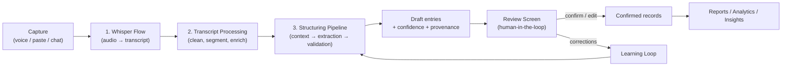
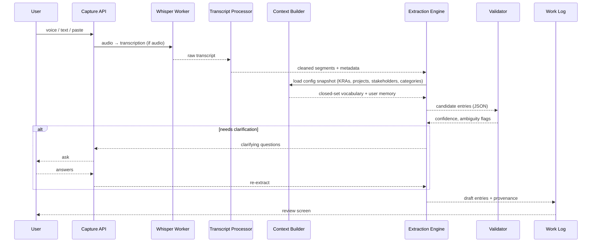
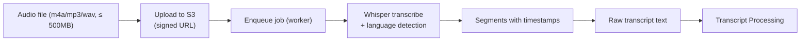
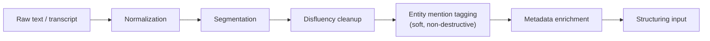
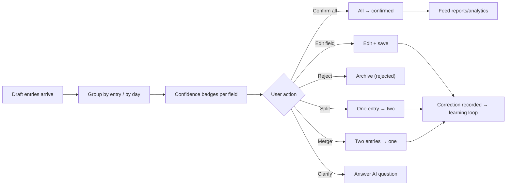
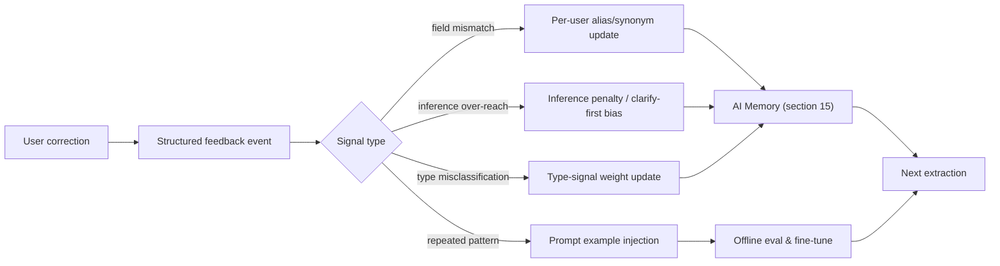
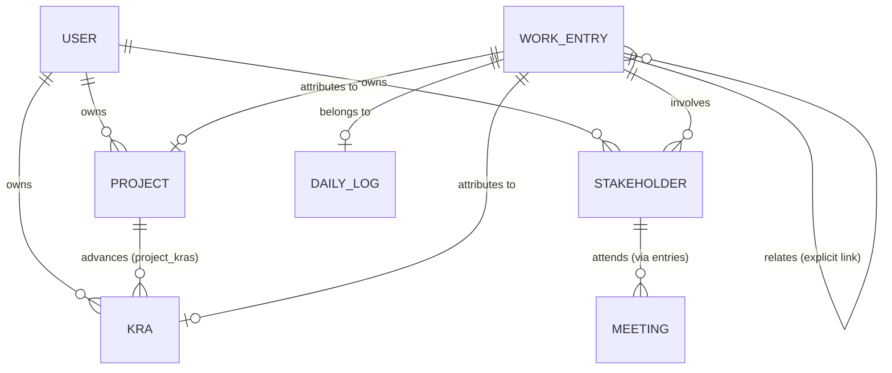

# PM Work Intelligence — AI Pipeline Design

- **Status:** Implementation-ready
- **Priority:** This is the system's core differentiator. Every design decision here serves the product principles: **provenance on everything**, **confidence transparency**, **no fabrication**, **configuration drives intelligence**, and **human-in-the-loop**.
- **Reference docs:** `00_PRODUCT_VISION.md`, `01_PRD.md`, `02_ARCHITECTURE.md`, `03_DATABASE.md`, `04_API.md`

---

## 1. Pipeline Overview

The AI pipeline transforms raw user input — voice, pasted notes, or typed conversation — into structured, provenance-backed work-log entries, reports, and analytics. It has three stages:





**Design decisions at a glance** (detailed throughout):

| Decision | Why |
|----------|-----|
| Two-stage voice path (Whisper → LLM structuring) | Separates speech-to-text from semantic structuring; each stage uses the right model; retries and eval are independent |
| Temperature 0 for extraction | Deterministic, consistent structuring output |
| Closed-set entity matching | Eliminates fabrication by construction (PRD AC-4.1) |
| Per-field confidence + clarification | Surfaces uncertainty instead of silently guessing (core principle #6) |
| Config snapshotting | Keeps analysis valid when configuration changes later |
| Worker-tier execution | Capture UX never blocks on AI (NFR-1.1, G-M3) |

---

## 2. Whisper Flow

### 2.1 Purpose

Convert spoken work descriptions into text. This is the **zero-burden capture** path (principle #7): a user can dictate a day's work and get structured entries without typing a single word.

### 2.2 Decision: Whisper as the speech-to-text engine

- Whisper (OpenAI Whisper / Whisper-large-v3, or a compatible hosted Whisper API) is chosen for its accuracy on conversational, code-adjacent, and acronym-heavy speech (PM vocabulary).
- Runs on the **worker tier** as an async job; the API returns `202 Accepted` with a job id (see `04_API.md` §6–7).

### 2.3 Flow



### 2.4 Parameters

| Parameter | Value | Decision rationale |
|-----------|-------|--------------------|
| Model | `whisper-large-v3` (or provider equivalent) | Best WER on accented/specialized speech; cost is acceptable for short dictations |
| Language | Auto-detect; client may pass `en` | Users dictate in their work language; MVP is English-only but detection future-proofs |
| `prompt` (initial context) | Injected with configured entity names | Biases transcription toward the user's actual vocabulary (project names, acronyms, stakeholder names) |
| `word_timestamps` | `true` | Enables per-segment provenance spans into the transcript |
| `temperature` | `0` | Deterministic transcription for auditability |
| `max_audio` | 25 MB per chunk if chunked | Enables long recordings (meetings) via segmentation |

### 2.5 Whisper Prompt Example (transcription context)

```
The following is a work dictation by a Program Manager at Acme.
Known project names: Project Phoenix, Atlas Migration, Kite Analytics.
Known people: David Chen (VP Eng), Maya Patel (PM), the Platform Team.
Known topics: release candidate, sprint review, 1:1, onboarding timeline.
Transcribe the audio accurately, preserving proper nouns verbatim.
```

### 2.6 Whisper JSON Output (segment-level)

```json
{
  "job_id": "wh_41e7",
  "status": "completed",
  "language": "en",
  "duration_seconds": 185.2,
  "text": "Reviewed the Phoenix release candidate with the platform team. Shipped the API docs update. Then had a one-on-one with David about the onboarding timeline. Spent about three hours total.",
  "segments": [
    {
      "id": 0,
      "start": 0.0,
      "end": 12.4,
      "text": "Reviewed the Phoenix release candidate with the platform team.",
      "tokens": [201, 304, 18]
    },
    {
      "id": 1,
      "start": 12.4,
      "end": 24.1,
      "text": "Shipped the API docs update.",
      "tokens": [89, 401, 12]
    },
    {
      "id": 2,
      "start": 24.1,
      "end": 44.0,
      "text": "Then had a one-on-one with David about the onboarding timeline.",
      "tokens": [150, 210, 33]
    }
  ]
}
```

**Decision:** segments carry timestamps so provenance can point into the audio itself, not just the text. This supports the "trace every claim to source" principle.

---

## 3. Transcript Processing

### 3.1 Purpose

Turn raw transcription (or raw pasted/typed text) into a clean, segmented, enrichment-ready representation that the structuring engine consumes.

### 3.2 Pipeline Steps



### 3.3 Step Details & Decisions

| Step | Operation | Decision rationale |
|------|-----------|--------------------|
| **Normalization** | Lowercase index copy, Unicode normalization, whitespace collapse | Consistent matching and character-span provenance |
| **Segmentation** | Split into utterance/sentence units; for transcripts, group Whisper segments into topical utterances | Keeps provenance spans readable and maps to `work_entry_sources.span_start/span_end` (see `03_DATABASE.md` §4.12) |
| **Disfluency cleanup** | Remove filler words ("um", "uh", "you know"), repeated false starts, and timestamps | Reduces noise the LLM must interpret; the **original transcript is always preserved** for audit |
| **Entity mention tagging** | Non-destructive annotation of potential entity mentions (project names, people, meetings, "one-on-one", "docs", etc.) | Pre-signals candidates to the extraction engine; reduces LLM latency and ambiguity |
| **Metadata enrichment** | Attach: source type (voice/text/paste), recording id, session id, speaker labels (future), timestamp of capture, user timezone | Provides context the extraction engine needs for date/day attribution |

### 3.4 Cleaned Input Example

```json
{
  "session_id": 15,
  "source": "voice",
  "recording_id": "rec_9f2b",
  "captured_at": "2026-08-07T17:30:00Z",
  "timezone": "America/Los_Angeles",
  "utterances": [
    {
      "index": 0,
      "text": "Reviewed the Phoenix release candidate with the platform team.",
      "span_start": 0,
      "span_end": 61,
      "segments": [
        { "start": 0.0, "end": 12.4 }
      ],
      "mention_hints": { "projects": ["Phoenix"], "people": ["platform team"] }
    },
    {
      "index": 1,
      "text": "Shipped the API docs update.",
      "span_start": 61,
      "span_end": 88,
      "segments": [
        { "start": 12.4, "end": 24.1 }
      ]
    },
    {
      "index": 2,
      "text": "Then had a one-on-one with David about the onboarding timeline.",
      "span_start": 88,
      "span_end": 151,
      "segments": [
        { "start": 24.1, "end": 44.0 }
      ]
    },
    {
      "index": 3,
      "text": "Spent about three hours total.",
      "span_start": 151,
      "span_end": 184,
      "segments": []
    }
  ]
}
```

**Decision:** spans are computed over the *cleaned* text, and the mapping to original segments is retained. Provenance is therefore lossless even after cleanup.

---

## 4. Prompt Engineering

### 4.1 Purpose

Prompts are the interface between configuration and the model. They are **template-driven and versioned**, never ad-hoc. Every prompt follows a strict structure that encodes the product's safety rules.

### 4.2 Prompt Anatomy

Every extraction prompt has the same five-part skeleton:

```
SYSTEM — Role & principles
USER — Configuration context (closed sets)
USER — Task & output schema
USER — Grounding & provenance rules
USER — Input transcript/utterances
```

### 4.3 System Prompt Example (extraction)

```
You are the structuring engine for PM Work Intelligence, an AI work
intelligence platform. You convert natural descriptions of work into
structured work-log entries.

PRINCIPLES (non-negotiable, in priority order):
1. GROUNDING: Every structured value MUST be traceable to the user's
   words. Do NOT invent facts, entities, dates, or numbers that are not
   in the input or explicitly requested.
2. CLOSED SETS: Only assign entities that exist in the provided
   configuration lists. Never invent a KRA, project, or stakeholder.
3. CONFIDENCE: Assign a confidence score (0-1) to every field. When
   you are unsure, score low and flag for clarification.
4. CLARIFICATION OVER GUESSING: If a value is genuinely ambiguous
   between two or more closed-set candidates, do NOT guess. Emit a
   clarification request instead.
5. INFERENCE LABELING: If you derive a value that the user did not
   state (e.g., assigning a project when none was named), mark it as
   inferred.
6. FIDELITY: Preserve the user's own terminology. Do not rename
   projects, people, or deliverables.
7. PRIVACY: Work only with the text provided. Do not use general
   knowledge about the user's company.
```

**Decision:** principles are numbered and ordered so that grounding/no-fabrication outranks completeness. When trade-offs are unavoidable (e.g., a missing project vs. a guessed project), the model must prefer the honest incomplete answer.

### 4.4 Task & Output Schema (user turn)

```
TASK:
Analyze the input utterances and produce structured work-log entries.
For each distinct activity, produce one entry.

OUTPUT (valid JSON only, matching this schema):
{
  "entries": [
    {
      "summary": "short imperative or noun-phrase description",
      "details": "optional extended detail from the user's words",
      "entry_type": "meeting|deliverable|documentation|learning|bug|feature|other",
      "kra_id": null | integer,
      "project_id": null | integer,
      "stakeholder_ids": [integer],
      "hours": null | number,
      "work_date": "YYYY-MM-DD",
      "field_confidence": {
        "summary": 0.0-1.0,
        "entry_type": 0.0-1.0,
        "kra_id": 0.0-1.0,
        "project_id": 0.0-1.0,
        "stakeholder_ids": 0.0-1.0,
        "hours": 0.0-1.0,
        "work_date": 0.0-1.0
      },
      "inferred_fields": ["kra_id", "hours"],
      "source_refs": [
        { "utterance_index": 0, "span_start": 0, "span_end": 61 }
      ]
    }
  ],
  "clarifications": [
    {
      "id": "cl_5aa1",
      "field": "project_id",
      "question": "Which project does this refer to?",
      "candidates": [7, 12]
    }
  ]
}
```

### 4.5 Grounding Rules (user turn)

```
GROUNDING RULES:
- Only output ids that exist in the CONFIGURATION below.
- "hours" must be a plausible numeric estimate; if the user gave a
  total for multiple activities, distribute it reasonably and mark
  hours as inferred unless the user attributed time to the activity.
- "work_date": default to the capture date (provided below) unless the
  user names a different day. Mark as inferred if you defaulted it.
- Never include a stakeholder that is not in the configuration list
  and not a recognizable named person in the text. If an unconfigured
  person appears, leave the stakeholder out and mention them in
  "details" only.
- source_refs MUST point at the exact utterances that support the
  summary and every attributed field.
```

**Decision:** the grounding rules are explicit *behavioral constraints*, not just aspirations — the output schema is validated against them by the deterministic Validator (§9), which rejects and re-runs output that violates them.

### 4.6 Temperature & Sampling

| Task | Temperature | Why |
|------|-------------|-----|
| Extraction / structuring | `0` | Deterministic, low-entropy output; same input → same structure |
| Clarification phrasing | `0.2` | Slightly natural but still stable |
| Report/insight narrative | `0.4–0.7` | Creative prose quality while remaining grounded in records |
| Daily summary | `0.4` | Balanced |

### 4.7 Model Tiering

| Tier | Model role | Trigger |
|------|-----------|---------|
| Fast model | Extraction, entity matching, clarification | Every capture |
| Strong model | Report generation, long-context reasoning | Report/insight generation only |
| Escape hatch | Re-extraction after validation failure | Rare; higher cost tolerated for correctness |

**Decision:** cost is kept under control by using a fast model for the hot path and reserving the strong model for narrative tasks (matches `02_ARCHITECTURE.md` §4.3 cost control).

---

## 5. Context Building

### 5.1 Purpose

Configuration drives intelligence (principle #3). The Context Builder assembles a **snapshot** of the user's active configuration into the closed-set vocabulary the model is allowed to use.

### 5.2 What Gets Loaded

| Source | What is included | Excluded |
|--------|------------------|----------|
| KRAs | Active KRAs: `id`, `name`, `aliases`, `description` | Inactive/archived KRAs (AC-2.2: flagged for user resolution, not auto-assigned) |
| Projects | Active projects: `id`, `name`, `description`, `status` | Archived/completed projects from the AI closed-set |
| Stakeholders | Active stakeholders: `id`, `name`, `role`, `organization`, `relationship_type` | Inactive stakeholders |
| Categories | Time-allocation categories + targets | — |
| User memory | Correction-derived synonyms and preferences (§14) | Anything not user-confirmed |
| Day context | Capture date + timezone, recent confirmed work (optional, bounded) | Old/unrelated history |

### 5.3 Configuration Block Example

```
CONFIGURATION (CLOSED SETS — use ONLY these):
KRAs:
- id 1: Stakeholder Management
  aliases: [Stakeholders, Exec Comms, Engagement]
  description: Executive alignment and status communication.
- id 3: Platform Architecture
  aliases: [Platform Arch, Architecture]
  description: Own architecture, scalability, and platform reliability.

PROJECTS:
- id 7: Project Phoenix
  description: Next-gen platform rebuild.
  status: active
- id 12: Atlas Migration
  description: Cloud migration of core services.
  status: active

STAKEHOLDERS:
- id 21: Platform Team
  role: Engineering group, organization: Acme
- id 5: David Chen
  role: VP Engineering, organization: Acme
- id 33: Maya Patel
  role: Product Manager, organization: Acme

TIME-ALLOCATION CATEGORIES:
- Delivery (target 50%), Stakeholder Management (target 20%),
  Learning (target 10%), Other (target 20%)

CAPTURE CONTEXT:
- capture date: 2026-08-07 (America/Los_Angeles)
- today is Friday
```

### 5.4 Snapshot Versioning

- The snapshot is frozen with a `config_snapshot_id` UUID at extraction time.
- Stored in `ai_analysis.config_snapshot` (`03_DATABASE.md` §4.13).
- Reports and analytics can therefore be re-derived exactly, even after the user edits their configuration.

**Decision:** versioning is essential because "configuration drives intelligence" — if the config changes, historical analysis must not silently shift meaning.

### 5.5 Context Budgeting

| Rule | Value | Why |
|------|-------|-----|
| Max active KRAs in prompt | 25 | Beyond this, add a note "user has more KRAs; only those most relevant" |
| Max projects in prompt | 50 | Prevents prompt bloat; larger sets use retrieval (see Future Roadmap) |
| Max stakeholders in prompt | 50 | Same |
| Recent-work context | Last 7 confirmed entries, ≤ 3 KB | Supports continuity ("same as yesterday's meeting") without context bleed |
| Total context cap | ≤ ~4k tokens per extraction call | Cost + latency control |

---

## 6. KRA Detection

### 6.1 Task

Attribute each work entry to the responsibility area it advances — using only the user's configured KRAs.

### 6.2 Decision Rules

1. **Exact/alias match first.** If the user names a KRA or one of its aliases ("worked on Platform Architecture", "Architecture stuff"), match with high confidence.
2. **Semantic inference second.** If no KRA is named but the entry's activity maps clearly to one KRA's description (e.g., "sent the exec status deck" → Stakeholder Management), assign it **as an inference**.
3. **No KRA** if no match and no reasonable inference. Leave `kra_id: null`, flag a low-confidence empty field, and optionally suggest a KRA in the review screen.
4. **Multiple plausible KRAs** → clarification request (list candidate ids), never pick arbitrarily.

### 6.3 Prompt Fragment

```
DECISION — KRA:
- Match the entry to exactly one KRA from the CONFIGURATION, or null.
- Prefer an explicit name/alias mention (stated) over a semantic
  match (inferred). Mark inference accordingly.
- If two+ KRAs are plausible and the text is ambiguous, put the
  candidates in clarifications and set kra_id to null.
- Never invent a KRA name.
```

### 6.4 Output Example

```json
{
  "entry": {
    "summary": "Reviewed the Phoenix release candidate",
    "entry_type": "deliverable",
    "kra_id": 3,
    "field_confidence": { "kra_id": 0.97 },
    "inferred_fields": []
  }
}
```

**Inference example** (no KRA named):

```json
{
  "entry": {
    "summary": "Sent the quarterly exec status deck",
    "kra_id": 1,
    "field_confidence": { "kra_id": 0.71 },
    "inferred_fields": ["kra_id"]
  }
}
```

**Decision explained:** the model is allowed to infer, but *must label* the inference and score it lower. This satisfies "AI never fabricates; it labels inferences as such" (PRD FR-4.7) while still producing useful records when users don't spell everything out.

---

## 7. Project Detection

### 7.1 Task

Attribute entries to a configured project.

### 7.2 Decision Rules

1. **Explicit name match** → high confidence. "Phoenix", "Project Phoenix", "Phoenix RC" all resolve to `project_id 7` (name + alias matching).
2. **Ambiguous short-form** → clarification. "the big one" with two projects → clarification with candidates, never a guess (PRD AC-3.3).
3. **Project inferred from KRA/project-KRA link.** If a KRA is matched and only one active project links to it, a project assignment is a *weak inference*.
4. **No project** → `null`. Unattributed entries are surfaced to the user (insight: "missing project attribution", FR-7.3).

### 7.3 Output Example

```json
{
  "clarifications": [
    {
      "id": "cl_5aa1",
      "field": "project_id",
      "question": "You mentioned 'the big one' — which project did you mean?",
      "candidates": [
        { "id": 7, "name": "Project Phoenix" },
        { "id": 12, "name": "Atlas Migration" }
      ]
    }
  ]
}
```

### 7.4 Disambiguation Heuristics

| Signal | Weight | Source |
|--------|--------|--------|
| Exact name | 1.0 | Text match |
| Alias / abbreviation | 0.9 | `aliases` config |
| KRA co-occurrence | 0.5 | `project_kras` join |
| Recent activity (last 14 days) | 0.2 | Work history |
| Stakeholder co-occurrence | 0.3 | `work_entry_stakeholders` history |

**Decision:** these heuristics are used only to *rank clarification candidates*, not to override the user. If the top candidate is clearly dominant (score gap > 0.4) and confidence high, the model may assign with `inferred: true`; otherwise it clarifies.

---

## 8. Stakeholder Detection

### 8.1 Task

Identify the people/groups involved in each work activity — again, against the configured closed set.

### 8.2 Decision Rules

1. **Configured name/alias match** → map to stakeholder id.
2. **Unconfigured named person** → do **not** fabricate a stakeholder record (PRD AC-4.1). Keep the name in `details` as free text; optionally emit a "suggest creating stakeholder X" hint to the review screen.
3. **Group references** ("the team", "platform team") → match to configured group stakeholders if alias maps; otherwise leave unmatched.
4. **Engagement level** per stakeholder: `led` / `participated` / `informed` (from `work_entry_stakeholders.engagement`). "I ran the 1:1" → led; "attended the sync" → participated; "sent them the status" → informed.

### 8.3 Output Example

```json
{
  "entry": {
    "summary": "Had a one-on-one with David about the onboarding timeline",
    "stakeholder_ids": [5],
    "stakeholder_engagements": { "5": "led" },
    "field_confidence": { "stakeholder_ids": 0.94 },
    "inferred_fields": []
  }
}
```

**Unconfigured-person handling:**

```json
{
  "entry": {
    "summary": "Kickoff with the new SRE consultant Jordan",
    "stakeholder_ids": [],
    "details": "Kickoff with Jordan (SRE consultant, not yet in my stakeholder list).",
    "field_confidence": { "stakeholder_ids": 0.3 },
    "suggestions": [
      { "type": "create_stakeholder", "name": "Jordan", "role": "SRE consultant" }
    ]
  }
}
```

**Decision explained:** this is the no-fabrication guarantee made concrete. The pipeline prefers an honest gap (missing stakeholder + suggestion) over an invented entity, which protects trust (risk R1) and satisfies AC-4.1.

---

## 9. Meeting Detection

### 9.1 Task

Identify entries that are meetings and capture their structure (purpose, attendees, outcomes).

### 9.2 Detection Signals

| Signal | Examples | Strength |
|--------|----------|----------|
| Explicit meeting verbs | "had a 1:1", "attended", "hosted", "sat in on", "sync", "standup", "review" | High |
| Meeting nouns | "1:1", "standup", "steering committee", "demo", "workshop" | High |
| Timestamps / scheduling language | "on Monday", "this morning", "at 3pm" | Medium (also sets date) |
| Multiple attendees implied | "with the platform team" | Medium |

### 9.3 Extracted Meeting Structure

| Field | Source | Confidence basis |
|-------|--------|------------------|
| `summary` | Meeting purpose phrase | Stated → high; paraphrased → medium |
| `stakeholder_ids` | Attendees (closed set) | Name match → high; group match → medium |
| `details` | Outcomes/agenda | Grounded verbatim quotes → high |
| `hours` | Duration stated or estimated | Stated → high; estimated → low + inferred |
| `work_date` | Day stated or capture date | Stated → high; defaulted → inferred |

### 9.4 Output Example

```json
{
  "entry": {
    "entry_type": "meeting",
    "summary": "Weekly program sync",
    "details": "Reviewed Phoenix RC status; next release gate on Monday.",
    "stakeholder_ids": [21, 33],
    "hours": 1.0,
    "work_date": "2026-08-07",
    "field_confidence": {
      "entry_type": 0.99,
      "stakeholder_ids": 0.85,
      "hours": 0.92
    },
    "inferred_fields": []
  }
}
```

**Decision:** meetings are a first-class type because they are the single largest recurring time sink for the target personas (6 meetings/day for Nadia). Accurate meeting capture directly drives the persona value proposition.

---

## 10. Deliverable Detection

### 10.1 Task

Identify tangible outputs: docs written, designs produced, releases shipped, reports filed.

### 10.2 Detection Signals

| Signal | Examples |
|--------|----------|
| Producing verbs | "wrote", "shipped", "published", "created", "filed", "completed" |
| Artifact nouns | "spec", "docs", "design", "deck", "PR", "release candidate", "report", "API reference" |
| Completion language | "finished", "delivered", "closed out", "got it out the door" |
| Review/output verbs | "reviewed", "approved", "validated" (output-oriented review) |

### 10.3 Decision Rules

- One artifact → one deliverable entry (even if several were produced in the same day).
- "Reviewed the release candidate" → a deliverable (`reviewed` artifact), **not** a meeting, unless attendees/timestamps indicate a meeting was involved.
- Deliverable and meeting can both be present in one utterance ("presented the design at the demo" → meeting + deliverable).

### 10.4 Output Example

```json
{
  "entry": {
    "entry_type": "deliverable",
    "summary": "Shipped the API docs update",
    "details": "Published webhook retry semantics to the public API reference.",
    "project_id": 7,
    "kra_id": 3,
    "hours": 2.0,
    "work_date": "2026-08-07",
    "field_confidence": {
      "entry_type": 0.97,
      "hours": 0.8
    },
    "inferred_fields": ["project_id", "kra_id"]
  }
}
```

**Decision:** deliverable detection feeds the highest-value analytics (what got shipped vs. what consumed time) and powers persona value ("show what shipped and which KRAs were advanced").

---

## 11. Hour Estimation

### 11.1 Task

Estimate effort in decimal hours per entry, honoring the configured time-allocation rules (PRD FR-4.8).

### 11.2 Decision Rules

1. **Stated hours win.** "Spent 3 hours on the review" → 3.0, high confidence, not inferred.
2. **Explicit total with distribution.** "Spent about 3 hours total" across 3 activities → distribute proportionally to activity weight; mark each `hours` as `inferred`.
3. **Meeting durations.** Stated ("hour-long 1:1") or conventional (1:1 ≈ 0.5–1.0, standup ≈ 0.25–0.5) — estimated, inferred.
4. **Deliverable effort.** Relative to complexity language ("quick update" ≈ 0.5, "wrote the full spec" ≈ 3–4) — estimated, inferred, low confidence.
5. **No signal** → `null` hours rather than a fabricated number. The review screen shows the gap; the user can supply effort. Analytics skip null-hours entries for time charts (with a visible "unattributed time" bucket).

### 11.3 Distribution Example

Input: *"Reviewed the Phoenix release candidate with the platform team, shipped the API docs update, and had a 1:1 with David about the onboarding timeline. Spent about three hours total."*

```json
{
  "entries": [
    { "summary": "Reviewed the Phoenix release candidate", "hours": 1.25, "inferred_fields": ["hours"], "field_confidence": { "hours": 0.62 } },
    { "summary": "Shipped the API docs update", "hours": 1.0, "inferred_fields": ["hours"], "field_confidence": { "hours": 0.6 } },
    { "summary": "1:1 with David on onboarding timeline", "hours": 0.75, "inferred_fields": ["hours"], "field_confidence": { "hours": 0.65 } }
  ]
}
```

**Decision explained:** hours are the single most opinionated field. The pipeline therefore: (a) never states an unstated number as fact, (b) always marks estimates as inferred with modest confidence, and (c) always lets the user override with one edit. This preserves "accuracy is the currency" without making the record unusable when the user is vague.

### 11.4 Category Compliance

- Hours are later bucketed into the user's time-allocation categories for the "actual vs. target" analytics (FR-7.2).
- If the total estimated hours exceed the configured working-hours baseline, the Validator flags a soft warning surfaced in the review screen (not a hard error).

---

## 12. Confidence Score

### 12.1 Purpose

Confidence is the trust currency of the entire system (core principle #6). Every field carries a score; the overall entry confidence aggregates them.

### 12.2 Field-Level Confidence Computation

Each field's confidence is **model-assigned but deterministically re-scored** by the Validator:

| Component | Weight | Basis |
|-----------|--------|-------|
| Explicit vs. inferred | 0.5 | `inferred_fields` — stated = high base, inferred = penalized |
| Text-match strength | 0.3 | Exact/alias vs. fuzzy match for entity fields |
| Multi-candidate ambiguity | 0.2 | Inverse of # of plausible candidates found |

Field score = weighted combination, then adjusted by deterministic rules:

| Rule | Adjustment |
|------|------------|
| Field left `null` | Score recorded (e.g., 0) but treated as "needs input", not failure |
| Inferred field with weak signal | Cap at 0.6 |
| Stated with exact entity match | Floor at 0.9 |
| Clarification resolved by user | Re-score to 0.98 on the resolved field |

### 12.3 Overall Entry Score

```
overall_confidence = weighted mean of field scores,
weights: summary 0.25, entry_type 0.15, project_id 0.15,
kra_id 0.15, stakeholder_ids 0.10, hours 0.10, work_date 0.10
```

### 12.4 Banding & UI Semantics

| Band | Range | Review-screen treatment |
|------|-------|--------------------------|
| High | ≥ 0.85 | Auto-collapsed, no highlight |
| Medium | 0.6 – 0.85 | Expandable, yellow badge on affected fields |
| Low | < 0.6 | Expanded, red badge, clarification suggested |

### 12.5 Output Example (scored entry)

```json
{
  "entry": {
    "id": 901,
    "summary": "Reviewed the Phoenix release candidate",
    "entry_type": "deliverable",
    "kra_id": 3,
    "project_id": 7,
    "stakeholder_ids": [21],
    "hours": 1.25,
    "work_date": "2026-08-07",
    "overall_confidence": 0.88,
    "field_confidence": {
      "summary": 0.97,
      "entry_type": 0.9,
      "kra_id": 0.97,
      "project_id": 0.95,
      "stakeholder_ids": 0.88,
      "hours": 0.62,
      "work_date": 0.95
    },
    "inferred_fields": ["hours"],
    "source_refs": [
      { "utterance_index": 0, "span_start": 0, "span_end": 61 }
    ]
  }
}
```

**Decision explained:** confidence must be *auditable*, not just displayed. By recomputing it deterministically from explicitness, match strength, and ambiguity, the platform can measure its own calibration (M6–M8) and the numbers are reproducible in logs.

---

## 13. Review Screen

### 13.1 Purpose

The human-in-the-loop checkpoint (principle #5). AI proposes; the user disposes. This is where corrections are born and where the learning loop (section 14) gets its fuel.

### 13.2 Layout & Semantics



### 13.3 UI Elements per Entry

| Element | Behavior |
|---------|----------|
| **Summary** | Editable text; "stated vs. inferred" tag |
| **Entry type** | Dropdown (closed enum) |
| **KRA / Project** | Dropdowns populated from config; shows confidence; "inferred" tag |
| **Stakeholders** | Tag picker; engagement selector per stakeholder |
| **Hours** | Numeric input; shows "estimated" tag when inferred |
| **Work date** | Date picker (default capture date) |
| **Source preview** | Expandable quote of the source utterance with highlight on the span; clickable audio segment (voice path) |
| **Actions** | Confirm · Edit · Reject · Split · Merge · Ask AI |
| **Suggestion chips** | e.g., "Create stakeholder 'Jordan'?", "Attach KRA 'Platform Architecture'?" — one-click acceptance |

### 13.4 Review API Contract

See `04_API.md` §9.2: `PATCH /worklog/entries/{id}` with `version` for optimistic locking; corrections are captured as feedback events.

### 13.5 Review Metrics (measured)

| Metric | Target |
|--------|--------|
| Entries confirmed with zero edits (M6) | ≥ 95% |
| Clarification requests per capture (M7) | 5–15% |
| Edit frequency by field | tracked → tuning signal |
| Rejection rate | tracked → fabrication/quality signal |

---

## 14. Learning from User Corrections

### 14.1 Purpose

Corrections are not just fixes — they are the training signal that makes the AI better over time (FR-8, core principle #5). The loop is **per-user** first, global second.

### 14.2 Correction Event

Every user edit/rejection/clarification-answer is captured as a structured event:

```json
{
  "event_id": "ev_9d21",
  "user_id": 42,
  "work_entry_id": 901,
  "config_snapshot_id": "snap_a1",
  "model_name": "fast-extract-v1",
  "prompt_version": "struct-v4",
  "correction_type": "field_edit",
  "field": "project_id",
  "ai_value": 12,
  "user_value": 7,
  "ai_confidence": 0.55,
  "ai_inferred": true,
  "source_refs": [
    { "utterance_index": 0, "span_start": 0, "span_end": 61 }
  ],
  "created_at": "2026-08-07T17:31:00Z"
}
```

### 14.3 The Learning Loop



### 14.4 Per-Signal Actions

| Signal | Immediate action (online) | Delayed action (offline) |
|--------|---------------------------|--------------------------|
| User corrects a project/KRA/stakeholder id | Add the corrected mapping as a user memory alias; boost that entity in future ranking | Aggregate into eval set; adjust heuristics |
| User rejects an inference | Increase the threshold before the model infers; prefer `null` + clarification | Adjust inference rule weights |
| User reclassifies entry_type | Update type-signal weights (e.g., "demo" now maps to meeting) | Add few-shot example to prompt |
| User splits/merges entries | Register segmentation preference for similar utterances | Add to segmentation few-shots |
| User answers a clarification | Cache resolved mapping (e.g., "the big one" → Phoenix) in user memory | — |
| User clicks "suggested stakeholder" | Create stakeholder + link; record positive signal | — |

### 14.5 Guardrails

- **Per-user memory is private**: corrections never leak to other users.
- **Global learning** only uses *aggregated, anonymized* signals, never raw user work data, unless the user opts in (NFR-4.2).
- Corrections are stored with full provenance so any behavior change is auditable and reversible.

---

## 15. AI Memory

### 15.1 Purpose

AI Memory gives the pipeline durable, per-user context that makes extraction smarter without requiring the user to reconfigure. It is the practical foundation for the knowledge graph (§16).

### 15.2 Memory Store

| Store | Contents | TTL |
|-------|----------|-----|
| **Entity memory** | Confirmed mappings: alias → entity id ("the big one" → project 7) | Persistent until user edits config |
| **Preference memory** | Per-user thresholds: inference sensitivity, clarification frequency, verbosity | Persistent |
| **Recency memory** | Recently active projects/KRAs/stakeholders with last-active dates | Rolling 90 days |
| **Correction memory** | Correction-derived synonyms and disambiguation rules | Persistent, prunable |
| **Episodic memory** | "Same as Tuesday's sync" references resolved to prior entries | Rolling 30 days |

### 15.3 Injection into Context

Memory entries are merged into the Context Builder output (§5) with explicit labels:

```
USER MEMORY (learned from your corrections — override if wrong):
- "the big one" → Project Phoenix (confirmed 3x)
- "reviews" → entry_type deliverable (confirmed 2x)
- Inference preference: prefer asking when project unclear
```

**Decision:** memory is always *suggestive context*, never truth. The model sees it as hints, and the review screen lets the user invalidate any learned rule ("forget this").

### 15.4 Memory Lifecycle

| Stage | Trigger | Action |
|-------|---------|--------|
| Create | Confirmed correction or explicit user preference | Insert with source `correction`/`user` |
| Strengthen | Repeated confirmation of same mapping | Increment confidence count |
| Degrade | User contradicts a memory | Decrement; prompt "forget this?" |
| Invalidate | Config entity archived/deleted | Purge related memory entries |

---

## 16. Knowledge Graph

### 16.1 Purpose

The knowledge graph captures relationships between the entities the AI touches, enabling cross-entry reasoning, insight generation, and future autonomous features. It is derived from confirmed work records, not free text.

### 16.2 Graph Model



**Nodes:** users, KRAs, projects, stakeholders, work entries (typed), categories.
**Edges:** attributes-to, involves, advances, attends, relates, targets (allocation).

### 16.3 Construction

1. Confirmed work entries create/refresh graph edges.
2. Weights on edges accumulate from hours and touchpoint counts.
3. The graph is **derived and regenerable** from the relational store (`03_DATABASE.md`) — it is a query/aggregation layer, not a second source of truth.

### 16.4 What It Enables (MVP → Horizon)

| Capability | MVP | Horizon |
|------------|-----|---------|
| Stakeholder engagement analytics | ✓ (aggregation over joins) | — |
| "Who am I spending time with, on what" | ✓ (edge weights) | — |
| Project risk by KRA over-commitment | ✓ | — |
| Semantic "what was I doing around X?" | — | Vector retrieval over nodes |
| Proactive suggestions ("you haven't touched Atlas this week") | — | ✓ |
| Agentic orchestration (draft status, prep 1:1) | — | ✓ |

### 16.5 Storage Decision

- **MVP:** the graph is computed on the fly from relational tables via the analytics service. No separate graph store.
- **Horizon 2+:** materialize into a graph DB or a read-optimized edge table + vector index when cross-user, cross-time reasoning demands it.
- **Consistency rule:** the relational store is the source of truth; graph artifacts are always rebuildable and never edited directly.

---

## 17. Validation & Post-Processing (Validator)

### 17.1 Purpose

The Validator is the deterministic safety net between the LLM and the database. It enforces what the prompt *asks* but the model might violate.

### 17.2 Checks

| Check | Rule | On failure |
|-------|------|------------|
| JSON validity | Output parses against the schema | Re-extract (bounded retries) |
| Closed-set membership | `kra_id`, `project_id`, `stakeholder_ids` exist and are active | Drop unknown id → set null + note; re-extract if severe |
| Provenance validity | `source_refs` point within cleaned text; spans in-bounds | Repair to closest utterance; log |
| Confidence bounds | All scores in `[0,1]`; `overall_confidence` recomputed matches §12.3 | Recompute deterministically |
| Hours plausibility | `0 ≤ hours ≤ 24`; per-entry sane | Cap + flag |
| Date sanity | `work_date` not in the future beyond 1 day; within session window | Clamp + flag |
| No-fabrication audit | Every non-null entity field either matches closed set or is `inferred` with a source_ref | Reject entry, surface to review |
| Duplicate detection | Near-duplicate summaries within same input | Merge suggestion, not auto-merge |

### 17.3 Retry Policy

| Retry | Temperature | Outcome |
|-------|-------------|---------|
| Initial call | 0 | Normal |
| Retry 1 (schema violation) | 0 | Re-prompt with the failing output and validation error inline |
| Retry 2 | 0.1 | Allow slight variation |
| Give-up | — | Return `validation_failed`; degrade to raw text entry for manual review; log for eval |

---

## 18. End-to-End Worked Example

### 18.1 Input (voice)

Audio dictation: *"Reviewed the Phoenix release candidate with the platform team. Shipped the API docs update. Then had a one-on-one with David about the onboarding timeline. Spent about three hours total."*

### 18.2 Stage 1 — Whisper

Returns segments + text (see §2.6).

### 18.3 Stage 2 — Transcript Processing

Cleans filler, splits into 4 utterances, tags mentions (see §3.4).

### 18.4 Stage 3 — Extraction

Context built from config (§5.3). Model returns:

```json
{
  "entries": [
    {
      "summary": "Reviewed the Phoenix release candidate",
      "details": "Reviewed with the platform team.",
      "entry_type": "deliverable",
      "kra_id": 3,
      "project_id": 7,
      "stakeholder_ids": [21],
      "hours": 1.25,
      "work_date": "2026-08-07",
      "field_confidence": {
        "summary": 0.97, "entry_type": 0.9, "kra_id": 0.97,
        "project_id": 0.95, "stakeholder_ids": 0.88,
        "hours": 0.62, "work_date": 0.95
      },
      "inferred_fields": ["hours"],
      "source_refs": [{ "utterance_index": 0, "span_start": 0, "span_end": 61 }]
    },
    {
      "summary": "Shipped the API docs update",
      "details": "Published webhook retry semantics.",
      "entry_type": "deliverable",
      "kra_id": 3,
      "project_id": 7,
      "stakeholder_ids": [],
      "hours": 1.0,
      "work_date": "2026-08-07",
      "field_confidence": {
        "summary": 0.96, "entry_type": 0.95, "kra_id": 0.8,
        "project_id": 0.7, "stakeholder_ids": 0.0,
        "hours": 0.6, "work_date": 0.95
      },
      "inferred_fields": ["kra_id", "project_id", "hours"],
      "source_refs": [{ "utterance_index": 1, "span_start": 61, "span_end": 88 }]
    },
    {
      "summary": "1:1 with David on the onboarding timeline",
      "details": "Discussed onboarding timeline.",
      "entry_type": "meeting",
      "kra_id": 1,
      "project_id": 12,
      "stakeholder_ids": [5],
      "hours": 0.75,
      "work_date": "2026-08-07",
      "field_confidence": {
        "summary": 0.95, "entry_type": 0.99, "kra_id": 0.72,
        "project_id": 0.68, "stakeholder_ids": 0.94,
        "hours": 0.65, "work_date": 0.95
      },
      "inferred_fields": ["kra_id", "project_id", "hours"],
      "source_refs": [{ "utterance_index": 2, "span_start": 88, "span_end": 151 }]
    }
  ],
  "clarifications": []
}
```

### 18.5 Stage 4 — Validation

- All entity ids verified against the closed set ✓
- Hours 1.25 + 1.0 + 0.75 = 3.0 (matches stated total) ✓
- `kra_id: 3` and `project_id: 7` on entry 2 are flagged `inferred` (lower confidence) ✓
- Entry 3's `kra_id: 1`, `project_id: 12` are inferred from context (1:1 with exec on onboarding) — retained as inferences, surfaced in review ✓

### 18.6 Stage 5 — Review Screen

- Entry 1: high confidence → collapsed, green.
- Entry 2: medium (inferred project) → expandable, "Project inferred" badge.
- Entry 3: medium → expandable; suggestion chip: "KRA 'Stakeholder Management'? Project 'Atlas Migration'?".

User confirms all three as-is. Corrections (none) are recorded. Entries feed the daily log, reports, and the knowledge graph.

---

## 19. Quality, Evaluation & Monitoring

### 19.1 Eval Harness

| Suite | Measures | Target |
|-------|----------|--------|
| Fabrication | Entries containing invented entities/claims on golden set | < 0.5% (M8) |
| Accuracy | Field-level correctness on labeled corpus | ≥ 95% user-confirmed (NFR-5.1) |
| Ambiguity | Correct flagging of genuinely ambiguous inputs | ≥ 90% (NFR-5.3) |
| Provenance | % of fields with valid source_refs | 100% |
| Calibration | Confidence vs. observed accuracy per band | Within ±0.05 |

### 19.2 Production Monitoring

| Metric | Source | Alert |
|--------|--------|-------|
| Clarification rate | `ai_analysis.clarification_asked` | Outside 5–15% |
| Edit rate | Correction events | > 5% on confirmed |
| Rejection rate | Correction events (`correction_type: reject`) | > 2% |
| Latency p95 | `ai_analysis.latency_ms` | > 10s |
| Fabrication flag rate | Validator audit | > 0 |
| Cost per capture | `ai_analysis.tokens_used` × rate | Budget breach |

### 19.3 Versioning

- Prompts: `prompt_version` recorded per call (`struct-v4`).
- Models: `model_name` recorded per call.
- Eval sets: versioned alongside prompt changes; a prompt is only promoted if it improves or ties all three suites.

---

## 20. Future AI Roadmap

### 20.1 Near-Term (Post-MVP)

| Initiative | Description |
|------------|-------------|
| Speaker diarization | Attribute utterances to stakeholders in meeting dictations |
| Calendar & note ingestion | Auto-capture from calendar + meeting notes (feed the same pipeline) |
| Retrieval over history | Vector index over confirmed entries for "what was I doing when X?" |
| Insight/forecast generation | LLM-generated narrative insights over the analytics engine's rule outputs |

### 20.2 Mid-Term (Team/Org Horizon)

| Initiative | Description |
|------------|-------------|
| Team-level aggregation | Anonymized, permissioned cross-user insights |
| Report drafting agents | Autonomous weekly status drafts sent for approval |
| Fine-tuned extraction models | Distilled from correction datasets (with user consent) |
| Orchestrated agent mesh | Specialized agents (capture, summarizer, insight, forecaster) with routing |

### 20.3 Long-Term (Orchestration Horizon)

| Initiative | Description |
|------------|-------------|
| Proactive memory | The system pre-loads context based on predicted next tasks |
| Predictive capacity | Forecasting workload and delivery risk from historical patterns |
| Autonomous drafting | Auto-drafted 1:1 notes, review summaries, resource recommendations |
| Multi-language structuring | Whisper + LLM for non-English capture |

### 20.4 Roadmap Guardrails

- Every new AI feature must state its **eval suite** before shipping.
- Any feature that infers beyond the user's words must keep the explicit `inferred` label and human review.
- Per-user memory and graph artifacts remain **exportable, prunable, and forgettable** — the user always owns their intelligence.
