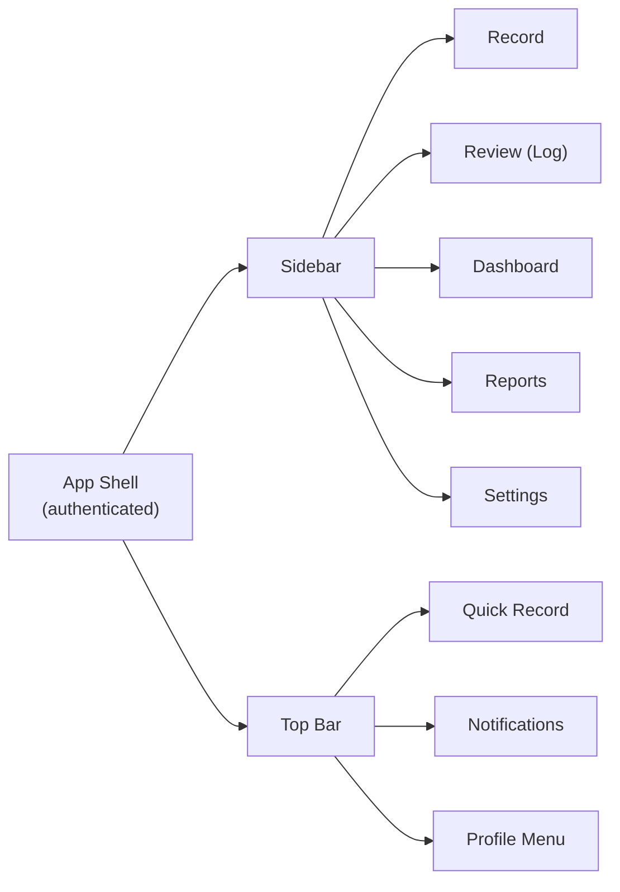
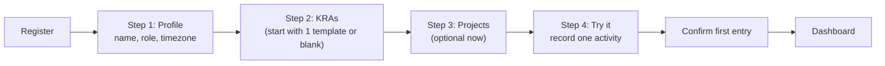

# PM Work Intelligence — UI/UX Design

- **Status:** Implementation-ready
- **Reference docs:** `00_PRODUCT_VISION.md`, `01_PRD.md`, `02_ARCHITECTURE.md`, `04_API.md`, `05_AI.md`
- **Scope:** MVP (responsive web, Next.js 15 + Tailwind CSS)

---

## 1. Design Principles

Every screen serves the core loop: **converse → structure → validate → report → decide**.

| Principle | Applied as |
|-----------|------------|
| **Zero-burden capture** | The Record screen is a chat box, not a form. Input takes ≤ 3 clicks. |
| **Review before save** | AI output is never silently committed; it lands in a review state with confidence indicators (FR-5.4, AC-5.1). |
| **Confidence transparency** | Every AI field shows confidence (high/medium/low) and a stated/inferred tag (§05-AI §12). |
| **Provenance on everything** | Every entry can expand to reveal the source text (and audio segment) it came from (US-12). |
| **Configuration drives intelligence** | Config screens explain *what the AI will now understand*, so edits feel consequential (AC-2.1). |
| **Reports, not raw data** | Dashboards and reports are narrative and visual intelligence, never raw event streams (principle #8). |
| **Human-in-the-loop** | Confirm/edit/reject/split/merge are first-class, one-click actions everywhere (principle #5). |
| **Trust through honesty** | When the AI is unsure it asks; when it infers it says so. No hidden guessing. |

---

## 2. Navigation

### 2.1 Global Navigation Structure



### 2.2 Wireframe — Desktop App Shell

```
┌─────────────────────────────────────────────────────────────────────────┐
│  ◆ PM Work Intelligence                    + Record   🔔   [ Avatar ▼ ]  │
├───────────┬─────────────────────────────────────────────────────────────┤
│  NAV      │                                                             │
│           │                                                             │
│  ● Record │  ACTIVE VIEW                                                 │
│  ☐ Review │                                                             │
│  ☐ Dash   │                                                             │
│  ☐ Reports│                                                             │
│  ☐ Config │                                                             │
│  ──────── │                                                             │
│  Settings │                                                             │
│  Profile  │                                                             │
│           │                                                             │
└───────────┴─────────────────────────────────────────────────────────────┘
```

### 2.3 Navigation Rules

| Element | Behavior |
|---------|----------|
| **Sidebar** | Primary navigation. Active item highlighted with brand color. Collapsible on tablet; hidden behind a hamburger on mobile. |
| **Top bar** | Global actions: `+ Record` (starts capture immediately), notification bell (badge = unread count), profile menu (Profile, Settings, Export data, Log out). |
| **Review badge** | Sidebar "Review" shows a count badge of unconfirmed (draft) entries — the nudge that drives validation habit (M3). |
| **Keyboard shortcuts** | `R` = new record, `1`–`5` = navigate top-level views, `Space` (in record) = hold-to-record audio. |
| **Unsaved-state awareness** | Navigating away from the Record screen with pending drafts shows a confirmation dialog; drafts are never lost (they persist as draft entries). |

### 2.4 Top Navigation Flows

**Quick Record (always available):** from any view, `+ Record` opens a modal/sheet with the capture composer. On submit, the user is taken to the Review screen with the new drafts at top.

**Notifications → action:** clicking a notification deep-links (report ready → open report; new insight → dashboard; reminder → record).

---

## 3. Information Architecture

### 3.1 Sitemap (MVP)

```
/                         Landing / redirect to dashboard
/login  /register         Auth
/onboarding               Guided first-time setup (3 steps)
/dashboard                KPIs + effort + insights
/record                   Conversational capture
/review                   Work-log review + daily/weekly views
/reports                  Report list + generation
/reports/[id]             Report detail (edit/export)
/analytics                Full analytics + insights (subset of dashboard depth)
/settings                 Preferences + AI preferences + categories
/settings/kras            KRA management
/settings/projects        Project management
/settings/stakeholders    Stakeholder management
/profile                  Profile + data export + account
```

### 3.2 IA Principles

- **Capture is one hop from everything.** Record and Review are the two primary screens; they are top-level and adjacent.
- **Configuration is grouped under Settings**, because it is set-up, not daily work.
- **Dashboards and Reports are consumption surfaces.** They share components (effort charts) but have different jobs: Dashboard = at-a-glance; Analytics = deep exploration; Reports = exportable artifacts.
- **Progressive disclosure.** Confidence/provenance/editing details are expandable, never in your face, until the user needs them.

### 3.3 Task → Screen Map

| Task | Primary screen | Secondary |
|------|----------------|-----------|
| "Record what I did" | Record | Review (after submit) |
| "Approve today's log" | Review | Dashboard (badge) |
| "Send my weekly status" | Reports | — |
| "Where did my time go?" | Analytics | Dashboard |
| "Add a new project" | Settings → Projects | — |
| "Tell AI what to call things" | Settings → KRAs | — |

---

## 4. Onboarding

### 4.1 Purpose

Get the user to a **first confirmed AI work log within 15 minutes** (NFR-6.1, M2) while minimizing configuration burden (risk R7).

### 4.2 Flow



- **"Configure later" is always available.** Starter templates (e.g., "Product Manager", "Engineering Manager") pre-seed KRAs/projects to reduce first-run friction (risk R7 mitigation).
- **Progress indicator** (Step 1 of 4) at top; back navigation allowed; step state persists so users can return.
- Completion triggers `onboarding_complete = true` in profile.

### 4.3 Wireframe — Onboarding Step 2 (KRAs)

```
┌───────────────────────────────────────────────────────┐
│  Setup in 4 quick steps        [ Skip for now → ]     │
│  ● 1 Profile  2 ● KRAs   3 ○ Projects   4 ○ Try it    │
├───────────────────────────────────────────────────────┤
│  What are your key result areas?                       │
│  The AI uses these to tag your work.                   │
│                                                         │
│  + Add KRA                                               │
│  ┌────────────────────────────────────────────────┐    │
│  │ KRA name    [ Delivery Management        ]     │    │
│  │ Description [ Own end-to-end delivery    ]     │    │
│  │ Add                                                   │
│  └────────────────────────────────────────────────┘    │
│                                                         │
│  • Platform Architecture                    [✕]       │
│  • Stakeholder Management                   [✕]       │
│                                                         │
│                 [ Back ]        [ Next: Projects → ]    │
└───────────────────────────────────────────────────────┘
```

---

## 5. Dashboard

### 5.1 Purpose

Answer "what happened, where did my effort go, and what should I notice?" in one glance (FR-7.1–7.5). Loads in < 2 s (NFR-1.2).

### 5.2 Wireframe — Dashboard (desktop)

```
┌────────────────────────────────────────────────────────────────────┐
│ Dashboard                       Range: [Week ▾]  [Aug 3–7] [‹ ›]  │
├────────────────────────────────────────────────────────────────────┤
│  KPI CARDS                                                          │
│  ┌──────────┐ ┌──────────┐ ┌──────────┐ ┌──────────┐ ┌──────────┐ │
│  │ 38.5 h   │ │ 17       │ │ 4        │ │ 11       │ │ 5        │ │
│  │ logged   │ │ confirmed│ │ projects │ │ meetings │ │deliver's │ │
│  └──────────┘ └──────────┘ └──────────┘ └──────────┘ └──────────┘ │
│  ┌───────────────────────────────┐ ┌─────────────────────────────┐ │
│  │ Effort by KRA                 │ │ Effort by Project           │ │
│  │  ████████ Platform 42.9%      │ │  ████████ Phoenix 51.9%     │ │
│  │  ██████  Stakeholder 31.2%    │ │  ██████ Atlas 31.4%         │ │
│  │  ████    Learning 12.6%       │ │  ███  Other 16.7%           │ │
│  └───────────────────────────────┘ └─────────────────────────────┘ │
│  ┌───────────────────────────────┐ ┌─────────────────────────────┐ │
│  │ Actual vs Target Time         │ │ Insights                    │ │
│  │ Delivery  60% ██████████░░░░  │ │ ! Stakeholder Mgmt above    │ │
│  │  (target 50%)                 │ │   target by 11 pts     [✕]  │ │
│  │ Stakeholder 31% █████░░░░░░░  │ │ ! No work logged Sun [✕]    │ │
│  └───────────────────────────────┘ └─────────────────────────────┘ │
└────────────────────────────────────────────────────────────────────┘
```

### 5.3 Components & Behaviors

| Component | Behavior |
|-----------|----------|
| **Range selector** | `Day / Week / Month / Quarter` with anchor-date picker and `‹ ›` chevrons. Persists choice per user. |
| **KPI cards** | Hours logged, confirmed entries, active projects, meetings attended, deliverables. Clicking a card navigates to the relevant filtered view. |
| **Effort charts** | Horizontal bars with percentage labels; percentages sum to 100% (AC-7.1). Hover shows hours + pct. |
| **Actual vs. Target** | Config-driven target percentages from Settings → Categories; over/under shown with color coding (green ≤ target, amber > target by ≤10 pts, red > by 10 pts). |
| **Insights panel** | Rule-based insights with severity color, dismiss (`✕`) and acknowledge actions (FR-7.5, AC-8.1). Empty state: "No insights — your week looks balanced." |
| **Empty state (first use)** | "No confirmed work yet. Record your first activity →" with a primary CTA to Record. |

### 5.4 User Flow

1. User opens Dashboard.
2. Server component fetches aggregates; Suspense streams KPIs → charts → insights.
3. User switches range; client re-fetches (SWR/React Query), charts animate transitions.
4. User dismisses an insight → `POST /analytics/insights/{id}/acknowledge`; card animates out.

---

## 6. Record Screen

### 6.1 Purpose

The zero-burden capture surface (FR-3). A chat that produces structured drafts. **This screen must never feel like a form.**

### 6.2 Wireframe — Record Screen

```
┌────────────────────────────────────────────────────────────────────┐
│ Record                                  [ Session: Fri review ▾ ] │
│                                                                     │
│  ┌──────────────────────────────────────────────────────────────┐  │
│  │  You · 5:42 PM                                                │  │
│  │  Reviewed the Phoenix release candidate with the platform     │  │
│  │  team. Shipped the API docs update. Then had a 1:1 with       │  │
│  │  David about the onboarding timeline. Spent ~3 hours total.   │  │
│  │                                                      [⏎]     │  │
│  ├──────────────────────────────────────────────────────────────┤  │
│  │  AI · now      (structuring…)  ▓▓▓▓▓▓▓░░░  3 activities found │  │
│  └──────────────────────────────────────────────────────────────┘  │
│                                                                     │
│  ┌──────────────────────────────────────────────────────────────┐  │
│  │  Quick actions                                                │  │
│  │  [🎤 Hold to talk]   [📋 Paste notes]   [＋ Manual entry]     │  │
│  └──────────────────────────────────────────────────────────────┘  │
│                                                                     │
│  ┌──────────────────────────────────────────────────────────────┐  │
│  │ [ Type or dictate what you worked on…                     ⏎ ] │  │
│  └──────────────────────────────────────────────────────────────┘  │
│  After submitting, drafts open in Review.                          │
└────────────────────────────────────────────────────────────────────┘
```

### 6.3 Input Modes

| Mode | Interaction | Notes |
|------|-------------|-------|
| **Type** | Chat composer, Enter to send | Multi-line supported (Shift+Enter) |
| **Voice** | Hold-to-talk mic button; browser `MediaRecorder`; audio uploaded, Whisper transcribes (§05-AI §2) | Live status: recording → transcribing → structured |
| **Paste** | "📋 Paste notes" opens a large text area | Meeting notes, chat snippets, emails |
| **Manual entry** | Fallback structured form (NFR-2.3 degradation path) | Never more than 1 click away, never the default |

### 6.4 AI Turn States

| State | UI |
|-------|-----|
| Structuring | Progress bar with descriptive label ("Reading your notes…", "Matching to Project Phoenix…") |
| Clarification needed | Inline question card: "Which project did you mean by 'the big one'?" with candidate chips → answer → re-extract (§05-AI §13.3) |
| Ready | Draft cards appear inline; banner: "Open Review to confirm (3 drafts)" |
| AI unavailable | Amber banner: "AI is temporarily unavailable. You can still add a manual entry." (G-M3) |

### 6.5 Clarification Card Wireframe

```
┌──────────────────────────────────────────────────────────┐
│  AI: You mentioned "the big one" — which project?        │
│  [ Project Phoenix ]   [ Atlas Migration ]   [ None ]    │
└──────────────────────────────────────────────────────────┘
```

### 6.6 User Flow (Record)

1. User opens Record (or presses `R`).
2. Types/dictates/pastes a description → submits.
3. `POST /capture/sessions/{id}/messages` → 201 with drafts; SSE streams structuring progress.
4. If clarification needed → answer chips → re-extract.
5. Drafts persist as `draft` entries; user is offered "Review now".
6. Session remains open for follow-up messages (conversation context, FR-3.3).

---

## 7. Review Screen

### 7.1 Purpose

The human-in-the-loop checkpoint (principle #5, AC-5). Confirm/edit/reject AI output; corrections feed the learning loop.

### 7.2 Wireframe — Review Screen (day view)

```
┌────────────────────────────────────────────────────────────────────┐
│ Review                                   View: [Day ▾] [Aug 7 ▾]   │
│  3 drafts · 14 confirmed                  Filter: [All ▾]          │
├────────────────────────────────────────────────────────────────────┤
│  ┌── DRAFT ────────────────────────────────────────────────────┐  │
│  │ [✓ Confirm all]  [Summary]  92%                             │  │
│  │ Summary:   Reviewed the Phoenix release candidate        [✎] │  │
│  │ Type:      deliverable   [Inferred: hours ▾]               │  │
│  │ Project:   Project Phoenix  (95% · stated)    [change]     │  │
│  │ KRA:       Platform Architecture (97% · stated) [change]   │  │
│  │ People:    + Platform Team (participated)          [＋]    │  │
│  │ Hours:     1.25  (estimated)   Date: 2026-08-07            │  │
│  │ ▸ Source: "Reviewed the Phoenix release candidate with the │  │
│  │   platform team."                          [play 0:00–0:12] │  │
│  │ [Confirm] [Edit] [Reject] [Split] [Merge ▾]               │  │
│  └──────────────────────────────────────────────────────────────┘  │
│  ┌── DRAFT (needs attention) ──────────────────────────────────┐  │
│  │ Summary:   Shipped the API docs update            [✎]      │  │
│  │ Project:   ⚠ inferred  (Atlas Migration?)  [change]        │  │
│  │            [ Use Phoenix ] [ Use Atlas ] [ None ]          │  │
│  │ Hours:     1.0 (estimated)                                 │  │
│  │ [Confirm] [Edit] [Reject] [Split] [Merge ▾]               │  │
│  └──────────────────────────────────────────────────────────────┘  │
│  ── Confirmed ───────────────────────────────────────────────────  │
│  ┌──────────────────────────────────────────────────────────────┐  │
│  │ ✓ Weekly program sync · meeting · 1.0h · Phoenix            │  │
│  └──────────────────────────────────────────────────────────────┘  │
└────────────────────────────────────────────────────────────────────┘
```

### 7.3 Entry States & Actions

| State | Visual | Actions available |
|-------|--------|-------------------|
| **Draft** | Amber left-border, "DRAFT" chip | Confirm · Edit · Reject · Split · Merge · Ask |
| **Needs attention** | Amber + red confidence badge on low-confidence fields | Same, plus suggestion chips |
| **Confirmed** | Green check, collapsed | Edit · Archive (Move to archive) |
| **Archived** | Muted, strikethrough on request | Restore · Delete |

### 7.4 Confidence & Inference Presentation

| Signal | UI treatment |
|--------|--------------|
| Confidence ≥ 0.85 | No badge (clean) |
| Confidence 0.6–0.85 | Amber dot + tooltip on the field |
| Confidence < 0.6 | Red dot; field highlighted; "needs attention" |
| `inferred` field | "inferred" tag next to value (e.g., `Hours: 1.25 (estimated)`) |
| `stated` field | No tag, or subtle "stated" in provenance expander |

### 7.5 Provenance Expander

```
▸ Source: "Reviewed the Phoenix release candidate with the platform team."
  └ Captured 5:42 PM · voice · session "Friday review"
    [▶ play 0:00–0:12]
```

- Every attributed field is clickable → highlights the span in the source text.
- Voice entries expose the audio segment player (§05-AI §2.6 timestamps).

### 7.6 User Flows

**Confirm-all:** top-of-group `✓ Confirm all` confirms every draft in the day (AC-5.1) → batch `PATCH`.

**Edit:** click `[✎]` → inline field editor opens (no page navigation) → save sends `PATCH /worklog/entries/{id}` with `version` → optimistic UI → correction event recorded (FR-5.5, AC-5.2).

**Split/Merge:** select split point or two entries → preview → confirm → two/one entries; provenance redistributed.

**Reject:** moves to `archived`, never silently deleted; feedback event `reject` stored.

**Suggested fix:** for low-confidence fields the AI pre-computes suggestion chips (e.g., alternative project). One click applies.

---

## 8. Reports

### 8.1 Purpose

Generate editable, exportable narrative reports (FR-6). Reports are artifacts for the user's real workflows (status updates, 1:1s, reviews).

### 8.2 Wireframe — Report List

```
┌────────────────────────────────────────────────────────────────────┐
│ Reports                                  [ + New report ]          │
│ ┌────────────────────────────────────────────────────────────────┐ │
│ │ Weekly Report — Aug 3–7, 2026      ready   [Open] [Export ▾]   │ │
│ ├────────────────────────────────────────────────────────────────┤ │
│ │ Daily Summary — Aug 7, 2026        ready   [Open] [Export ▾]   │ │
│ ├────────────────────────────────────────────────────────────────┤ │
│ │ Monthly — July 2026                draft   [Open] [Export ▾]   │ │
│ └────────────────────────────────────────────────────────────────┘ │
│ Filter: [All ▾]  Sort: [Newest ▾]                                  │
└────────────────────────────────────────────────────────────────────┘
```

### 8.3 Wireframe — Report Generator Modal

```
┌──────────────────────────────────────────────────────────────┐
│ New report                                                   │
│ Type:      (●) Daily   ( ) Weekly   ( ) Custom range         │
│ Range:     [ 2026-08-03 ] → [ 2026-08-07 ]                   │
│ Template:  [ Standard weekly ▾ ]  (configure in Settings)    │
│ Tone:      [ Neutral ▾ ]   Detail: [ Standard ▾ ]            │
│                      [ Cancel ]  [ Generate ]                │
└──────────────────────────────────────────────────────────────┘
```

### 8.4 Wireframe — Report Editor

```
┌────────────────────────────────────────────────────────────────────┐
│ ← Reports   Weekly Report — Aug 3–7, 2026      [ Export ▾ ]  Save │
├────────────────────────────────────────────────────────────────────┤
│ # Weekly Report — Aug 3–7, 2026                                     │
│                                                                     │
│ ## Highlights                                                       │
│ - Shipped API docs update (Phoenix)                                 │
│ - Progressed Atlas onboarding timeline                              │
│                                                                     │
│ ## By KRA                                                           │
│ ### Platform Architecture                                           │
│ Reviewed the Phoenix release candidate...                           │
│                                                                     │
│  [Edit prose inline]           Status: draft → ready on save        │
└────────────────────────────────────────────────────────────────────┘
```

### 8.5 Behaviors

| Element | Behavior |
|---------|----------|
| **Generate** | `POST /reports` → 202; progress state "generating"; SSE updates on completion; notification "Report ready" (deep-link). |
| **Edit** | Inline Markdown editing with live preview; save → `PATCH /reports/{id}` (AC-6.1 allows editing before export). |
| **Export** | Markdown / PDF via `GET /reports/{id}/export?format=`; PDF opens a preview before download. |
| **Template picker** | Templates configurable (sections, tone, verbosity) — FR-6.6. |
| **Empty state** | "Generate your first report" hero + sample report preview. |

### 8.6 User Flow (Weekly Status)

1. User clicks `+ New report` → generator modal.
2. Selects type/range/template → Generate.
3. Status card shows progress; user is notified on ready.
4. Opens report, edits tone/coverage, exports PDF, sends to leadership.

---

## 9. Analytics

### 9.1 Purpose

Deep exploration of effort and engagement (FR-7). Complements the Dashboard with more dimensions, longer ranges, and trend views.

### 9.2 Wireframe — Analytics

```
┌────────────────────────────────────────────────────────────────────┐
│ Analytics                        Range: [Quarter ▾] [Q2 2026 ▾]    │
├────────────────────────────────────────────────────────────────────┤
│  Tab: [Effort] [Time Allocation] [Stakeholders] [Trends]            │
│  ┌──────────────────────────────────────────────────────────────┐  │
│  │ Effort by KRA (stacked bars by week)                         │  │
│  │  ████▄▄▄▄▄▄▄▄▄▄▄▄▄▄▄▄▄▄▄▄▄▄▄▄▄▄▄▄▄▄▄▄▄▄▄▄▄▄▄▄▄▄        │  │
│  │  W1 W2 W3 W4 W5 W6 W7 W8 W9 W10 W11 W12 W13                  │  │
│  └──────────────────────────────────────────────────────────────┘  │
│  ┌──────────────────────────────────────────────────────────────┐  │
│  │ Time allocation: actual vs target                            │  │
│  │ Delivery       48.4% ██████████░░  target 50%                │  │
│  │ Stakeholder     31.2% ██████░░░░  target 20%  ⚠ over        │  │
│  └──────────────────────────────────────────────────────────────┘  │
│  ┌──────────────────────────────────────────────────────────────┐  │
│  │ Stakeholder engagement                                       │  │
│  │ David Chen  14 touchpoints · 9.0h   [View  →]                 │  │
│  │ Platform Team 11 touchpoints · 7.5h [View →]                 │  │
│  └──────────────────────────────────────────────────────────────┘  │
└────────────────────────────────────────────────────────────────────┘
```

### 9.3 Behaviors

| Tab | Content | Interactions |
|-----|---------|--------------|
| **Effort** | Grouped bar chart by dimension (KRA/project/type) over time | Click a bar → drill into that dimension's entries |
| **Time Allocation** | Actual vs. target bars; over/under markers | Config target links to Settings → Categories |
| **Stakeholders** | Engagement list (touchpoints, hours, relationship) | Click → filtered entry list |
| **Trends** | Weekly hours line chart; streaks | Hover tooltips |

### 9.4 Data Rules

- Analytics reflect **confirmed entries only** (matches Dashboard).
- Entries with `hours = null` are excluded from time charts and reported in a "unattributed time" note so totals are honest (§05-AI §11).
- Range limit for free exploration: quarter (longer ranges show aggregated monthly).

---

## 10. Settings

### 10.1 Structure

```
Settings
├── General (AI preferences, working hours, categories)
├── KRAs
├── Projects
└── Stakeholders
```

### 10.2 Wireframe — Settings (General)

```
┌────────────────────────────────────────────────────────────────────┐
│ Settings                                                           │
│  [General]  [KRAs]  [Projects]  [Stakeholders]                     │
├────────────────────────────────────────────────────────────────────┤
│ AI Preferences                                                     │
│  Detail level    (●) Brief  ( ) Standard  ( ) Detailed             │
│  Clarification   ( ) Always ask  (●) Balanced  ( ) Rarely ask      │
│  Default attribution  [✓] Auto-attach project when confident       │
│                                                                     │
│ Time Allocation                                                    │
│  Working hours/week    [ 40 ]                                       │
│  Categories                                                         │
│   Delivery     50%  ████████░░  [✎] [✕]                            │
│   Stakeholder  20%  ████░░░░░░  [✎] [✕]                            │
│   Learning     10%  ██░░░░░░░░  [✎] [✕]                            │
│   Other        20%  ████░░░░░░  [✎] [✕]   [+ Add category]         │
│                                                                     │
│ Data & Privacy                                                     │
│  [ ] Allow anonymized data to improve AI (opt-in only)              │
│  [ Export all data ]   [ Delete account ]                           │
└────────────────────────────────────────────────────────────────────┘
```

### 10.3 Behaviors

| Element | Behavior |
|---------|----------|
| **AI preferences** | Persist via `PATCH /settings`; changes take effect on the *next* extraction (config snapshotting preserves history). |
| **Categories** | Sum of targets ≈ 100% enforced with an inline warning (not a hard block). |
| **Export data** | Triggers `POST /export`; email/notification with archive download (FR-9.1). |
| **Delete account** | Two-step confirm modal with typed email + grace-period notice (AC-9.2). |
| **Privacy** | Opt-in consent is explicit; never enabled by default (NFR-4.2). |

---

## 11. Profile

### 11.1 Purpose

Account identity, display preferences, data ownership (FR-1.3, FR-9).

### 11.2 Wireframe — Profile

```
┌────────────────────────────────────────────────────────────────────┐
│ Profile                                                            │
│                                                                     │
│  [avatar]                                                           │
│  Display name    [ Nadia R.             ]                           │
│  Role            [ Senior Program Manager ▾ ]                       │
│  Timezone        [ America/New_York     ▾ ]                         │
│  Locale          [ English (US)         ▾ ]                         │
│                                                                     │
│  Account                                                           │
│  Email: nadia@example.com  (verified)    [Change password]          │
│                                                                     │
│  Data                                                              │
│  [ Export all data (JSON/CSV/Markdown) ]                            │
│  [ Delete account ]                                                 │
└────────────────────────────────────────────────────────────────────┘
```

### 11.3 User Flow

- Save → `PATCH /profile`; timezone validated against IANA set (invalid → inline error).
- Change password → email-link flow (never raw change on this screen).
- Export / Delete → same handlers as Settings §10.3.

---

## 12. KRAs (Config)

### 12.1 Purpose

Manage responsibility areas that drive AI attribution (FR-2.1, AC-2.1). **This screen must communicate the AI consequence of every edit.**

### 12.2 Wireframe — KRAs

```
┌────────────────────────────────────────────────────────────────────┐
│ Settings · KRAs                                                    │
│  The AI recognizes these when you talk about your work.            │
│  [+ Add KRA]                                                       │
│                                                                     │
│  ┌──────────────────────────────────────────────────────────────┐  │
│  │  Platform Architecture                          [•••]        │  │
│  │  Aliases: Platform Arch · Architecture                       │  │
│  │  Used by AI: Active                        [Archive] [Edit]  │  │
│  ├──────────────────────────────────────────────────────────────┤  │
│  │  Stakeholder Management                       [•••]          │  │
│  │  Aliases: Stakeholders · Exec Comms                          │  │
│  ├──────────────────────────────────────────────────────────────┤  │
│  │  (Archived) Discovery Loop  — no longer auto-assigned [Restore]│  │
│  └──────────────────────────────────────────────────────────────┘  │
└────────────────────────────────────────────────────────────────────┘
```

### 12.3 Behaviors

| Element | Behavior |
|---------|----------|
| **Add/Edit modal** | Fields: name (required, unique per user), description (context for AI), aliases (chips, "how else you call this"), priority (drag-to-reorder). |
| **Archive** | Soft-disable (FR-2.6). Archived KRAs move to a muted section and stop being auto-assigned (AC-2.2). Historical entries untouched. |
| **AI consequence banner** | On save: "Updated. New records will use this KRA. Existing records are unchanged." |
| **Drag ordering** | Reorders `priority`; sends `PATCH /kras` with new order (batch). |

### 12.4 User Flow

1. User adds "Platform Architecture" with aliases.
2. Later records the phrase "worked on the platform arch" → AI matches alias → KRA assigned (AC-2.1).

---

## 13. Projects (Config)

### 13.1 Purpose

Manage projects the AI attributes work to (FR-2.2).

### 13.2 Wireframe — Projects

```
┌────────────────────────────────────────────────────────────────────┐
│ Settings · Projects                                                │
│  [+ Add project]                                                   │
│  ┌──────────────────────────────────────────────────────────────┐  │
│  │  Project Phoenix                              ● active       │  │
│  │  Next-gen platform rebuild.                                   │  │
│  │  KRAs: Platform Architecture · Delivery                       │  │
│  │  Mar 1 – Dec 31, 2026 · Priority 1            [Edit] [•••]   │  │
│  ├──────────────────────────────────────────────────────────────┤  │
│  │  Atlas Migration                                ● at-risk     │  │
│  │  Cloud migration of core services.                            │  │
│  └──────────────────────────────────────────────────────────────┘  │
│  Filters: [All statuses ▾]   Archived projects are hidden by default│
└────────────────────────────────────────────────────────────────────┘
```

### 13.3 Behaviors

| Element | Behavior |
|---------|----------|
| **Add/Edit modal** | name, description, status (active/at-risk/on-hold/completed/archived), start/end dates, linked KRAs (multi-select), priority. |
| **Status color** | active=green, at-risk=amber, on-hold=gray, completed=blue, archived=muted. |
| **Archive vs. complete** | Archive removes from AI closed-set; "completed" keeps it recognizable but status-closed. |
| **Delete** | Soft-delete; entries keep the link (FK `SET NULL` on hard delete only). |

---

## 14. Stakeholders (Config)

### 14.1 Purpose

Manage people/groups the AI recognizes (FR-2.3).

### 14.2 Wireframe — Stakeholders

```
┌────────────────────────────────────────────────────────────────────┐
│ Settings · Stakeholders                                            │
│  [+ Add stakeholder]                                               │
│  ┌──────────────────────────────────────────────────────────────┐  │
│  │  David Chen · VP Engineering · Acme                          │  │
│  │  Relationship: executive      [Edit] [•••]                   │  │
│  ├──────────────────────────────────────────────────────────────┤  │
│  │  Platform Team · Engineering group · Acme                    │  │
│  │  Relationship: peer                                            │  │
│  └──────────────────────────────────────────────────────────────┘  │
│  Search: [david...]  Filter: [All relationships ▾]                 │
└────────────────────────────────────────────────────────────────────┘
```

### 14.3 Behaviors

| Element | Behavior |
|---------|----------|
| **Add/Edit modal** | name, role, organization, relationship type (manager/peer/report/customer/vendor/executive/other), contact, notes (AI context). |
| **Relationship filter** | Enables the engagement analytics filter. |
| **Archive** | Stops AI auto-assign; entries keep history. |
| **Suggestion flow** | When the AI flags an unconfigured person (AC-4.1), the Review screen offers "Create stakeholder" which pre-fills this form (§05-AI §8.3). |

---

## 15. Notifications

### 15.1 Purpose

In-app nudges and completions (report ready, insights, reminders).

### 15.2 Wireframe — Notifications Panel

```
┌──────────────────────────────────────────────┐
│ Notifications                    [Mark all]  │
│                                              │
│ ● Weekly report ready                  8:05  │
│   Your weekly report for Aug 3–7 is ready.   │
│              [ Open report ]                │
│ ───────────────────────────────────────────── │
│ ● 3 drafts awaiting review             7:55   │
│              [ Review now ]                  │
│ ○ Insight acknowledged · over-allocation     │
│ ● New: no work logged last Sunday      [✕]  │
└──────────────────────────────────────────────┘
```

### 15.3 Behaviors

| Element | Behavior |
|---------|----------|
| **Bell** | Unread count badge; opens right-side drawer. |
| **Rows** | Unread = filled dot + brand accent; read = muted. |
| **Actions** | Per-type CTA (Open report / Review now / View dashboard). |
| **Dismiss/read** | `POST /notifications/{id}/read` or `/dismiss`; "Mark all" batches reads. |
| **Preference** | Future: per-type toggles (report_ready always; reminders optional) — MVP ships read/dismiss only. |

---

## 16. AI Preferences (Settings)

### 16.1 Purpose

User control over AI behavior (FR-9.3): verbosity, clarification frequency, default attribution.

### 16.2 Wireframe — AI Preferences Section

```
┌────────────────────────────────────────────────────────────────────┐
│ AI Preferences                                                     │
│                                                                     │
│  Report verbosity                                                  │
│  (●) Brief        Standard        Detailed                          │
│  "Short bullets; highlights only"  "3-5 sentences per section"      │
│                                                                     │
│  Ask me when unclear                                               │
│  Always ask     (●) Balanced       Rarely ask                       │
│  "Highest accuracy"  "Ask only when genuinely ambiguous"            │
│                                                                     │
│  Default attribution (when confident)                               │
│  [✓] Auto-attach project     [✓] Auto-attach KRA     [ ] Hours      │
│                                                                     │
│  Learned rules                                                    │
│  "the big one" → Project Phoenix      [Forget]   (from corrections) │
│  "reviews" → deliverable              [Forget]   (from corrections) │
└────────────────────────────────────────────────────────────────────┘
```

### 16.3 Behaviors

- Each control maps to `settings.ai_preferences` (§04-API §13.2).
- **Learned rules** display AI Memory entries derived from corrections (§05-AI §15); "Forget" invalidates them — the user always has final authority over learned behavior.
- Setting copy explains *consequence*: "Balanced = we ask only when genuinely ambiguous, so ~1 in 10 recordings triggers a question" (matches M7 target 5–15%).

---

## 17. Responsive Behavior

### 17.1 Breakpoint Strategy

| Breakpoint | Width | Layout |
|-----------|-------|--------|
| **Mobile** | < 640px | Single column; sidebar → bottom tab bar; cards stack vertically |
| **Tablet** | 640–1024px | Two-column grids; collapsible sidebar; tables → cards |
| **Desktop** | > 1024px | Full IA as designed above |

### 17.2 Component Adaptation

| Component | Mobile | Tablet | Desktop |
|-----------|--------|--------|---------|
| **Navigation** | Bottom tab bar (Record, Review, Dash, More) | Hamburger drawer | Persistent sidebar |
| **Dashboard** | KPI cards = 2-col grid; charts stack | Charts 2-col | Full 2-col layout |
| **Record** | Full-screen composer; hold-to-talk is the primary input | Split input + transcript | As designed |
| **Review** | Entry cards expand; edit inline; actions in bottom action sheet | Cards 1-col with inline actions | Full card layout |
| **Reports** | Editor full-screen; export via share sheet | Editor + preview toggle | Side-by-side editor/preview |
| **Config screens** | Modal forms full-screen | Modal centered | Modal centered, wider |
| **Notifications** | Full-screen overlay | Drawer from right | Drawer from right |

### 17.3 Responsive Rules

- **Touch targets ≥ 44px** on mobile (record/confirm/reject primary actions).
- **Sticky bottom action bar** on mobile Review (Confirm all · Edit · Reject) so the most frequent action never scrolls off.
- **Safe-area insets** respected for hold-to-talk and bottom bars on notched devices.
- **Content density** reduces on mobile: hide optional provenance preview behind a chevron (still accessible for US-12).
- **Landscape/tablet** uses two columns where valuable (review list + editor).

### 17.4 Mobile Record Flow (primary persona case)

1. Tap **Record** in bottom tab bar → full-screen composer.
2. Hold the mic, describe the day, release → transcribing indicator.
3. Drafts arrive → swipe up to Review → confirm.
4. Total: two screens, three taps — meets "core tasks ≤ 3 clicks" (NFR-6.2).

---

## 18. Accessibility

| Requirement | Implementation |
|-------------|----------------|
| **Contrast** | WCAG 2.1 AA minimum; confidence colors also conveyed with icons (not color alone) |
| **Keyboard** | Full keyboard operability; visible focus rings; shortcut list documented in `?` overlay |
| **Screen readers** | ARIA labels on confidence badges, provenance toggle, and status chips; semantic landmarks |
| **Motion** | Respect `prefers-reduced-motion`; charts animate via opacity, not translate |
| **Forms** | Error messages inline with `aria-describedby`; validation on blur + submit |
| **Touch** | Target sizes ≥ 44px on mobile; no hover-only affordances |

---

## 19. Design Tokens (Summary)

| Token | Value | Use |
|-------|-------|-----|
| Brand primary | `#2563eb` | CTAs, active nav, confirm |
| Success | `#16a34a` | Confirmed state |
| Warning | `#d97706` | Medium confidence, at-risk |
| Danger | `#dc2626` | Low confidence, errors, reject |
| Neutral bg | `#f8fafc` / `#ffffff` | App background / surfaces |
| Text primary/secondary | `#0f172a` / `#475569` | Content hierarchy |
| Radius | `8px` (sm) / `12px` (md) | Cards and inputs |
| Font | Inter (system fallback) | Readable density for long records |

Full token spec lives in the frontend Tailwind theme (`frontend/tailwind.config.ts`).

---

## 20. Empty & Error States

| State | Screen | Content |
|-------|--------|---------|
| No confirmed work | Dashboard | Hero: "Record your first activity" → Record |
| No drafts | Review | Calm empty state + "Record now" |
| No reports | Reports | "Generate your first report" + sample |
| AI unavailable | Record/Review | Amber banner; manual entry promoted (G-M3) |
| Long job (report/whisper) | In-context | Progress card with cancel; no dead ends |
| Network error | Any | Retry banner, no data loss (NFR-2.2) |
| 409 conflict | Review edit | "This entry changed elsewhere — refreshed" then re-apply |
